# 💬 Custom Site Chat

### AI-powered chatbot platform for websites using RAG technology


---

## 🌐 Live Demo

**[https://custom-site-chat.com](https://custom-site-chat)**

Try it live! Upload your PDFs and create an intelligent chatbot in minutes.

---

## 📖 What is Custom Site Chat?

**Custom Site Chat** is a full-stack platform that transforms your PDF documents into an intelligent, conversational AI chatbot. Upload your documents, get an embed code, and add a smart chat widget to your website - no coding required!

### 🎯 Key Benefits

- 🚀 **5-Minute Setup** - Upload PDFs, copy code, paste into your website
- 🤖 **Powered by RAG** - Retrieval-Augmented Generation for accurate, source-based answers
- 🌍 **Multi-Language** - Supports Hebrew and English with automatic detection
- 🔒 **Secure & Isolated** - Each user gets their own private vector database collection
- 📱 **Embed Anywhere** - Works on any website with simple JavaScript snippet

---

## ✨ Features

### 🔐 User Management
- Multiple authentication methods (Email/Password, Google OAuth)
- Secure email verification
- Complete password recovery flow

### 📄 Document Processing
- PDF upload with real-time progress tracking
- Automatic text extraction and intelligent chunking
- AI-powered embeddings using OpenAI's text-embedding-3-large

### 💬 Smart Chat Widget
- Natural language queries in Hebrew or English
- Context-aware conversations (maintains chat history)
- Source citations with relevance scores
- Easy website integration with copy-paste code

### ⚙️ Collection Management
- Private Qdrant vector collection per user
- Secure API access with secret keys
- Customizable widget appearance

---

## 🏗️ System Architecture

```mermaid
%%{init: {'theme':'base', 'themeVariables': { 'primaryColor':'#E3F2FD','primaryTextColor':'#424242','primaryBorderColor':'#90CAF9','lineColor':'#BBDEFB','fontSize':'18px'}}}%%
flowchart TD
    Start([👤 Start]) --> Register[📝 Register]
    
    Register --> Verify[📧 Email Verification]
    Verify --> Login{🔐 Login}
    
    Login --> LoginEmail[Login with<br/>Email & Password]
    Login --> LoginGoogle[Login with<br/>Google OAuth]
    
    LoginEmail --> Dashboard[📊 Dashboard]
    LoginGoogle --> Dashboard
    
    Dashboard --> Actions{Choose Action}
    
    Actions --> Upload[📄 Upload PDFs]
    Actions --> View[👁️ View Documents]
    Actions --> Download[⬇️ Download Documents]
    Actions --> Delete[🗑️ Delete Documents]
    Actions --> GetCode[📋 Get Embed Code]
    Actions --> Logout[🚪 Logout]
    
    Upload --> Processing[⚙️ Processing]
    Processing --> Embeddings[🧠 Create Embeddings]
    Embeddings --> Ready[✅ Ready]
    
    Ready --> GetCode
    GetCode --> AddToSite[🌐 Add Code to Website]
    
    AddToSite --> WidgetLive[💬 Chat Widget Live!]
    
    WidgetLive --> VisitorAsk[🌐 Visitor Asks Question]
    VisitorAsk --> Search[🔍 Semantic Search]
    Search --> Generate[🤖 Generate AI Answer]
    Generate --> ShowAnswer[💬 Display Answer + Sources]
    
    style Start fill:#E3F2FD,stroke:#90CAF9,stroke-width:3px
    style Register fill:#FFF9C4,stroke:#FFF176,stroke-width:3px
    style Verify fill:#FFE0B2,stroke:#FFB74D,stroke-width:3px
    style LoginEmail fill:#E8F5E9,stroke:#81C784,stroke-width:3px
    style LoginGoogle fill:#E8F5E9,stroke:#81C784,stroke-width:3px
    style Dashboard fill:#EDE7F6,stroke:#CE93D8,stroke-width:3px
    style Upload fill:#FCE4EC,stroke:#F48FB1,stroke-width:3px
    style View fill:#E0F2F1,stroke:#4DB6AC,stroke-width:3px
    style Download fill:#E0F2F1,stroke:#4DB6AC,stroke-width:3px
    style Delete fill:#FFEBEE,stroke:#EF9A9A,stroke-width:3px
    style GetCode fill:#F3E5F5,stroke:#CE93D8,stroke-width:3px
    style Processing fill:#FFF3E0,stroke:#FFB74D,stroke-width:3px
    style Embeddings fill:#E1BEE7,stroke:#BA68C8,stroke-width:3px
    style Ready fill:#C8E6C9,stroke:#66BB6A,stroke-width:3px
    style AddToSite fill:#BBDEFB,stroke:#64B5F6,stroke-width:3px
    style WidgetLive fill:#B2DFDB,stroke:#4DB6AC,stroke-width:4px
    style VisitorAsk fill:#E3F2FD,stroke:#90CAF9,stroke-width:3px
    style Search fill:#F8BBD0,stroke:#F48FB1,stroke-width:3px
    style Generate fill:#D1C4E9,stroke:#9575CD,stroke-width:3px
    style ShowAnswer fill:#E1BEE7,stroke:#BA68C8,stroke-width:3px
```


---

## 🧠 How RAG Works

**RAG (Retrieval-Augmented Generation)** combines document search with AI generation for accurate, source-based answers.


**How it works:**
1. **Ingestion**: PDFs are uploaded, text is extracted, split into chunks, and converted to vector embeddings
2. **Search**: User questions are converted to embeddings and matched against stored vectors using semantic similarity
3. **Generation**: Top matching chunks are sent to GPT-4 as context to generate accurate, source-based answers

---

## 🚀 Tech Stack

### Backend
- **Spring Boot 3.3.4** - REST API framework
- **Java 21** - Programming language
- **PostgreSQL** - User accounts, metadata, logs
- **Qdrant** - Vector database for embeddings
- **AWS S3** - PDF file storage
- **OpenAI API** - Embeddings (text-embedding-3-large) and GPT-4

### Frontend
- **React 18.2** - User interface
- **React Router** - Client-side routing
- **Axios** - HTTP client

### Infrastructure
- **Docker & Docker Compose** - Containerization
- **Jenkins** - CI/CD automation
- **Nginx** - Reverse proxy
- **AWS EC2** - Cloud hosting

---

## 📚 Documentation

### 📖 Main Documentation
- **[User Guide](./USER-GUIDE.md)** - Complete user manual with screenshots
- **[Backend API](./backend/README.md)** - API documentation with examples
- **[Frontend](./frontend/README.md)** - Frontend architecture and setup

### 🏗️ Architecture & Deployment
- **[AWS Architecture](./docs/AWS-ARCHITECTURE.md)** - Cloud infrastructure setup
- **[CI/CD Pipeline](./docs/CICD-PIPELINE.md)** - Automated deployment process
- **[RAG Explanation](./docs/RAG-EXPLANATION.md)** - Deep dive into RAG implementation

---

## 🚀 Quick Start

### Prerequisites

- **Docker** & **Docker Compose**
- **Git**
- **OpenAI API Key**
- **AWS S3** (Access Key, Secret Key, Bucket)
- **JWT Secret Key**
- **PostgreSQL Password**
- **Gmail SMTP** (optional - for email verification)
- **Google OAuth** (optional - for social login)


### Installation

1. **Clone the repository**
```bash
git clone https://github.com/yourusername/custom-site-chat.git
cd custom-site-chat
```

2. **Configure environment**
```bash
cp .env.example .env
```

3. **Start services with Docker**
```bash
docker-compose build --no-cache
docker-compose up -d
```

4. **Access the application**
- Frontend: http://localhost:3000
- Backend API: http://localhost:8080

---

## 📊 Project Statistics

- **Total Lines of Code**: ~15,000+
- **API Endpoints**: 20+
- **Database Tables**: 6
- **Processing Stages**: 7
- **Supported Languages**: 2 (Hebrew, English)
- **Max File Size**: 50 MB
- **Vector Dimensions**: 3072

---

## 📄 License

This project is created for portfolio purposes.

---

## 📧 Contact

**Ester Ovrani**

- 📧 Email: ester.ovrani@gmail.com
- 💼 Portfolio: [custom-site-chat.com](https://custom-site-chat.com)
- 🐙 GitHub: [Your GitHub Profile](https://github.com/EsterOvrani)

---

## 🌟 Acknowledgments

- **OpenAI** for GPT-4 and text-embedding-3-large models
- **Qdrant** for high-performance vector search
- **Spring Boot** community for excellent documentation
- **React** team for the amazing UI library

---

<div align="center">
    <a href="https://custom-site-chat.com">🌐 Visit Live Site</a> •
    <a href="./USER-GUIDE.md">📖 User Guide</a> •
    <a href="./backend/README.md">🔧 API Docs</a>
  </p>
</div>
