# 📘 User Guide - Custom Site Chat

Complete guide for using the Custom Site Chat platform.

---

## 📑 Table of Contents

1. [Login](#1-login)
2. [Registration](#2-registration)
3. [Dashboard Overview](#3-dashboard-overview)
4. [Upload Documents](#4-upload-documents)
5. [Embed Chat Widget](#5-embed-chat-widget)
6. [Password Reset](#6-password-reset)
7. [Using the Chat Widget](#7-using-the-chat-widget)

---

## 1. Login

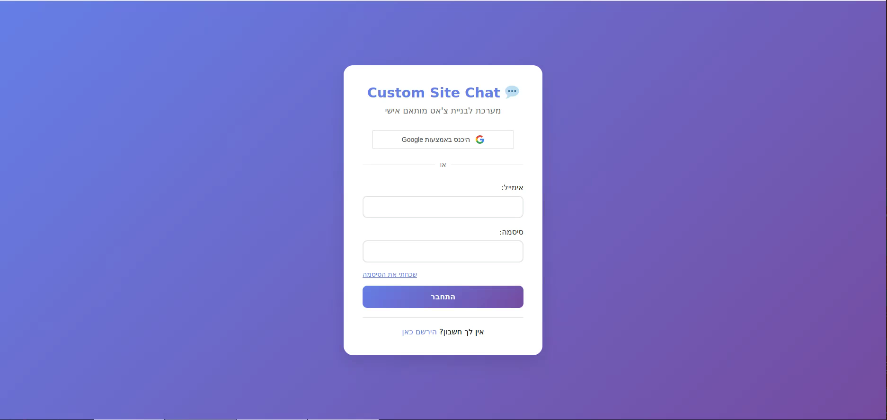

**Two login options:**

1. **Continue with Google** - Fast and secure (no password needed)
2. **Email and Password** - Enter your email and password

Simply choose your preferred method and click the corresponding button.

---

## 2. Registration

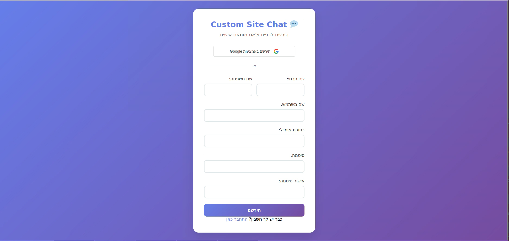

**Steps:**
1. Click **"Register"** on the login page
2. Enter email and password
3. Click **"Register"**

### 2.2 Email Verification

After registration, you'll see this verification code entry page.

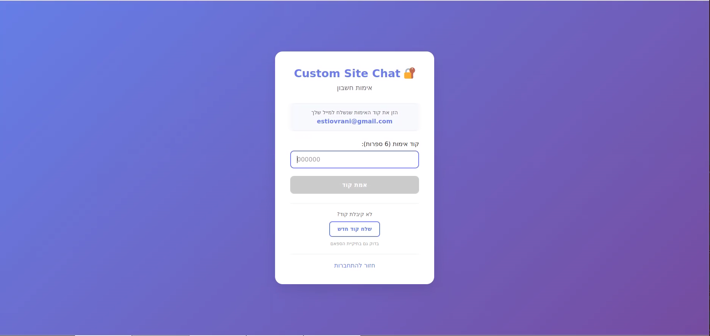

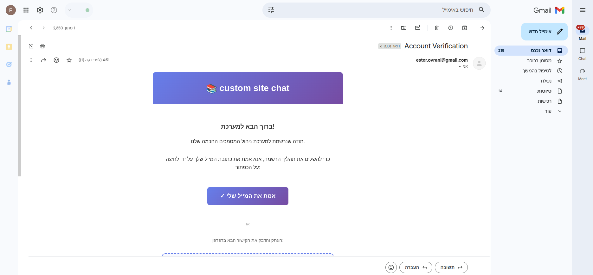

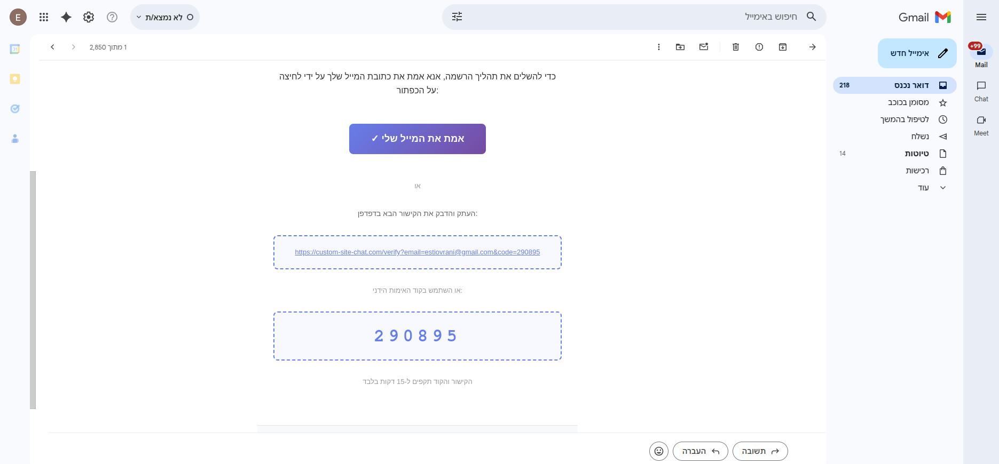

**Steps:**
1. Check your email inbox
2. Find the 6-digit verification code (highlighted in red rectangle)
3. Choose one of two verification methods:
   - **Option A**: Enter the 6-digit code manually in the verification page
   - **Option B**: Click the verification link/button in the email

**Didn't receive the code?**

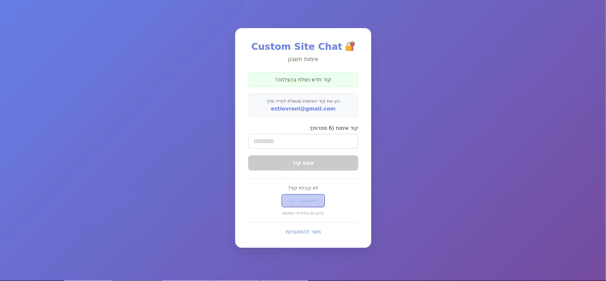

**Steps:**
1. Click the **"Resend Code"** button (green arrow points to it)
2. Wait a few moments
3. Check your inbox again for a new code

---

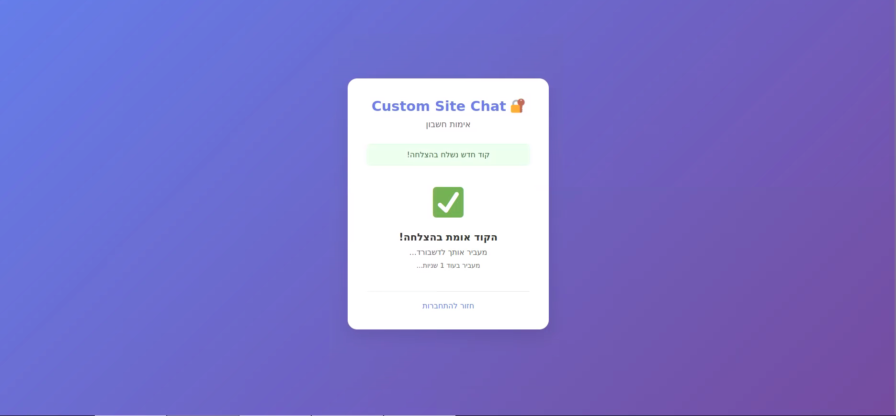

✓ Registration complete! You're now logged in.

---

## 3. Dashboard Overview

### 3.1 Empty Dashboard

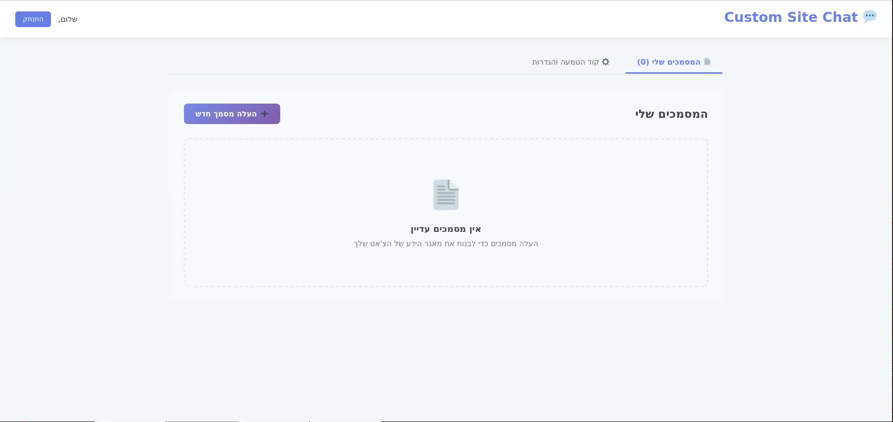

**Steps:**
1. Click **"Upload New Document"** button (blue arrow points to it) to start
2. You'll see two main tabs:
   - **My Documents (0)** - Upload and manage PDFs
   - **Collection Settings & Embed Code** - Get embed code

### 3.2 Dashboard After Upload

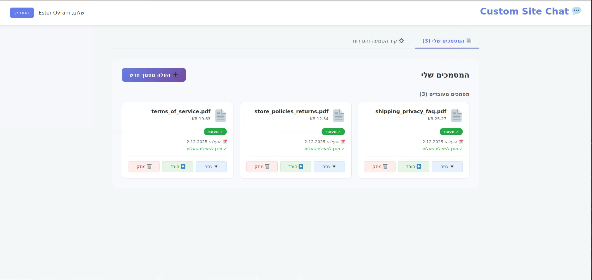

**Document Actions (arrows on image show each button):**
1. **View (צפה)** - Blue arrow - Click to open PDF in new browser tab
2. **Download (הורד)** - Green arrow - Click to download PDF to your computer
3. **Delete (מחק)** - Red arrow - Click to permanently remove document (cannot be undone)

**Additional Actions:**
4. **Upload New Document** - Purple arrow - Click to add more PDFs
5. **Logout (התנתק)** - Orange arrow - Click to sign out

**Document Information:**
- File name and size
- Processing status - Green circle highlights "✓ Processed"
- Upload date
- Number of text chunks

---

## 4. Upload Documents

### 4.1 Upload Dialog

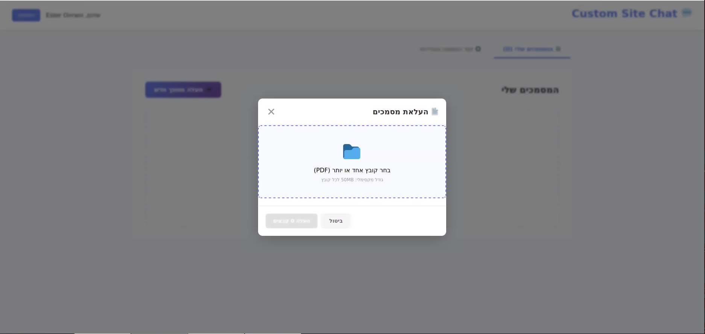

**Steps:**
1. Click **"Upload New Document"** button from dashboard
2. This upload dialog window opens
3. Click **"Choose File"** or drag and drop a PDF

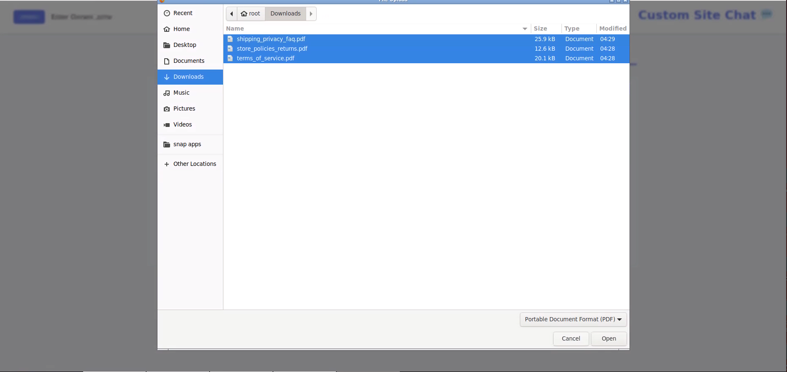

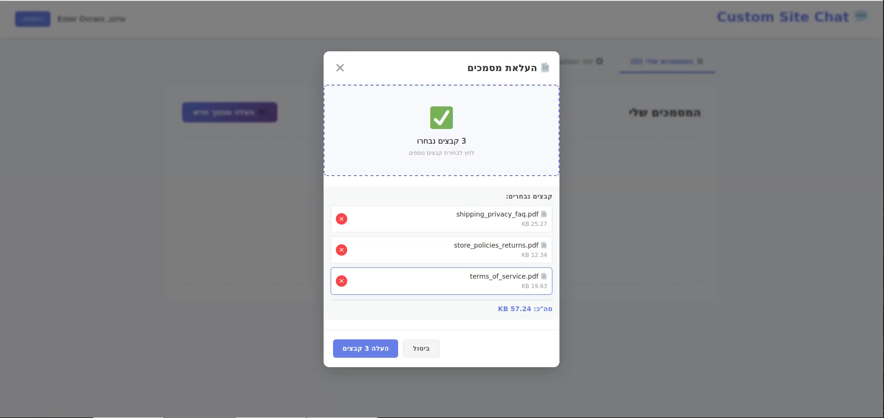

**Steps:**
1. Your computer's file browser opens
2. Navigate to your PDF file (blue arrow points to example file)
3. Select the PDF file
4. Click **"Open"**

**Requirements:**
- Format: PDF only
- Text-based (not scanned images)
- No password protection

### 4.2 Processing

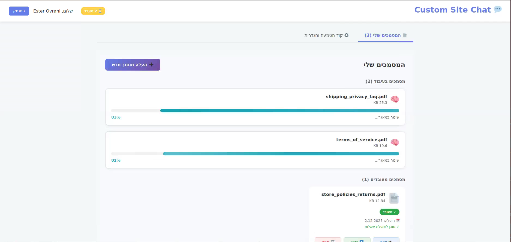

Your document will go through 5 processing stages:
1. Uploading file
2. Extracting text
3. Chunking content
4. Generating embeddings
5. Finalizing

**Processing Time:**
- Small (1-10 pages): 30-60 seconds
- Medium (10-50 pages): 1-3 minutes
- Large (50+ pages): 3-10 minutes

---

## 5. Embed Chat Widget

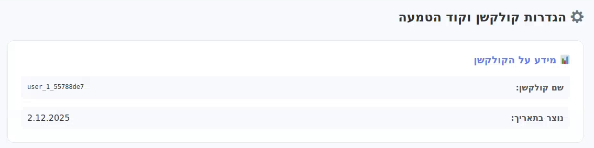

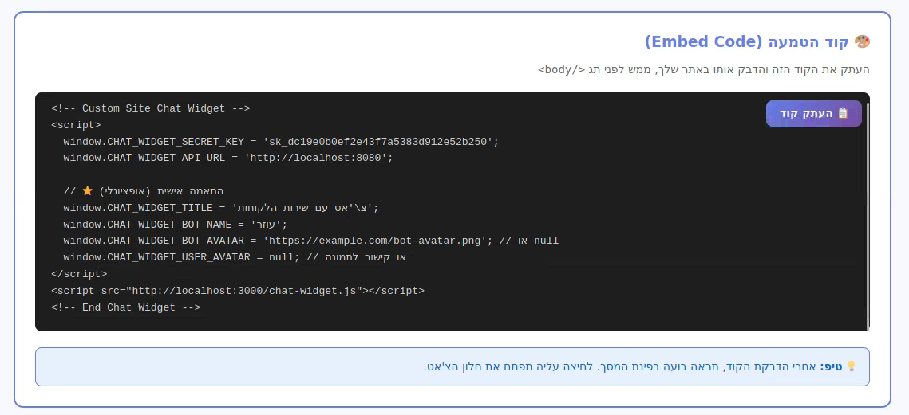

### How to Embed the Chat Widget

**Steps:**
1. Go to **"Collection Settings & Embed Code"** tab
2. Scroll down to the **"Embed Code"** section (blue rectangle)
3. Click **"Copy Code"** button (green arrow)
4. Paste the code before `</body>` tag in your website

**Example embed code:**

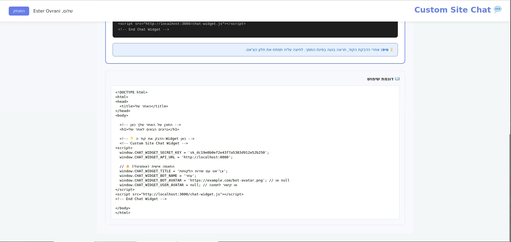

### Secret Key Management

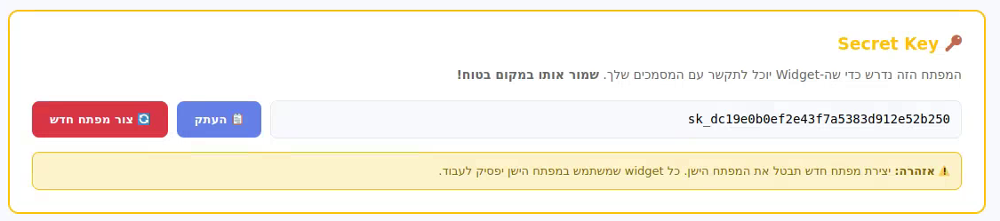

Your **Secret Key** (orange rectangle) is required for the widget to work.

**Actions:**
- **Copy** - Click the copy button (green arrow) to copy your key
- **Regenerate** - Click regenerate button (red arrow) if your key is compromised (this will invalidate the old key)

⚠️ **Important**: Keep your secret key confidential!

---

## 6. Password Reset

### 6.1 Forgot Password

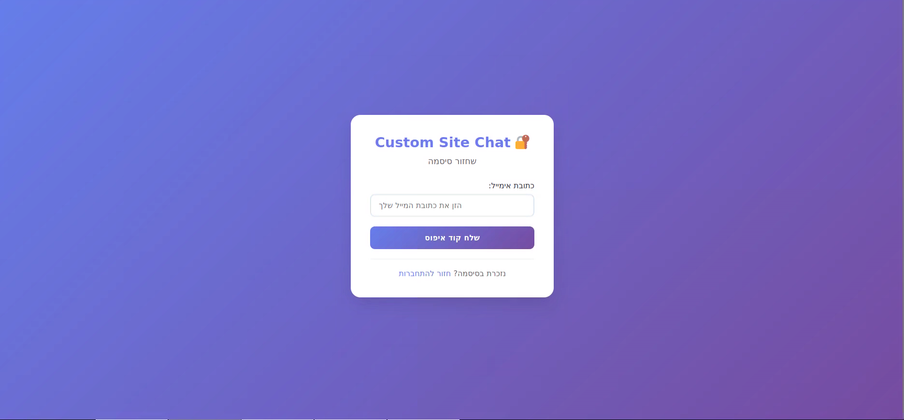

**Steps:**
1. On login page, click **"Forgot Password?"**
2. You'll see this password reset page
3. Enter your email address
4. Click **"Send Reset Code"**
   
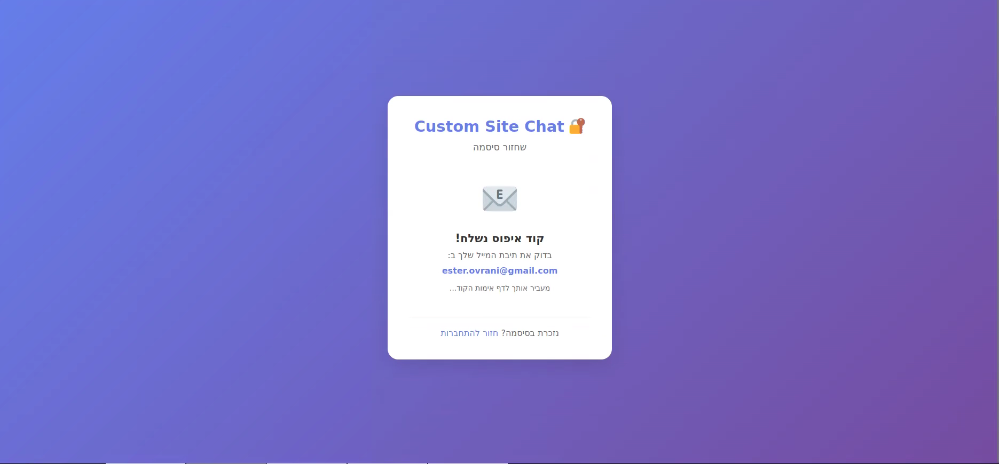

### 6.2 Verification Email

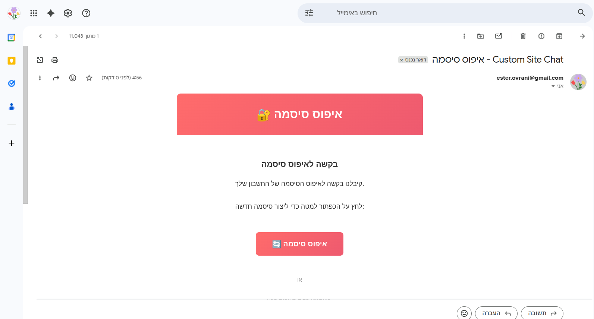
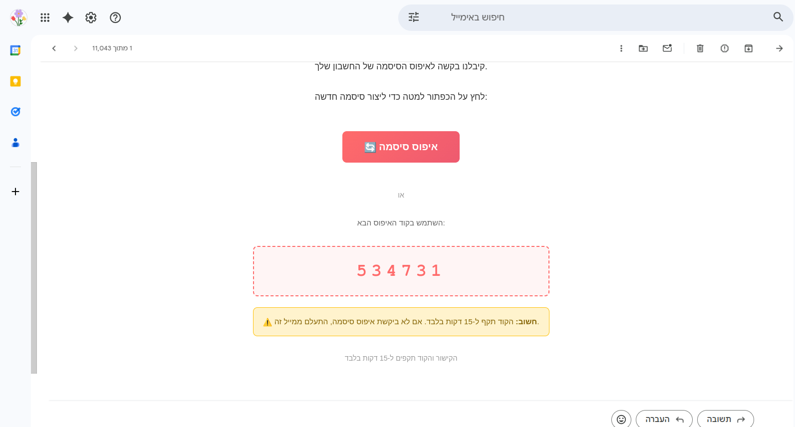

**Steps:**
1. Check your email inbox
2. Find the 6-digit reset code (orange rectangle highlights it)
3. Copy the code
4. Enter the 6-digit code from email in the field

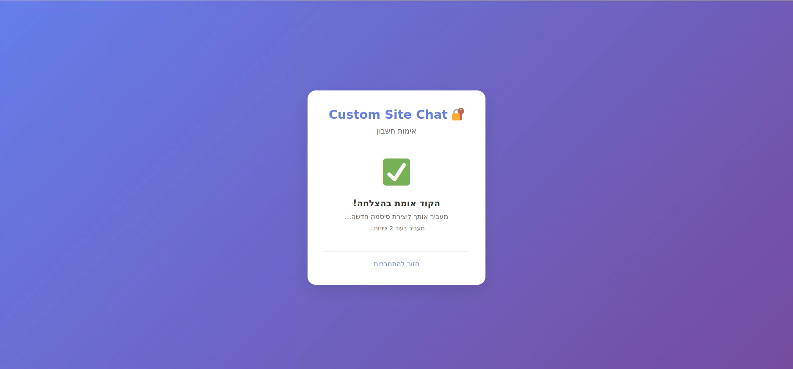

### 6.3 New Password

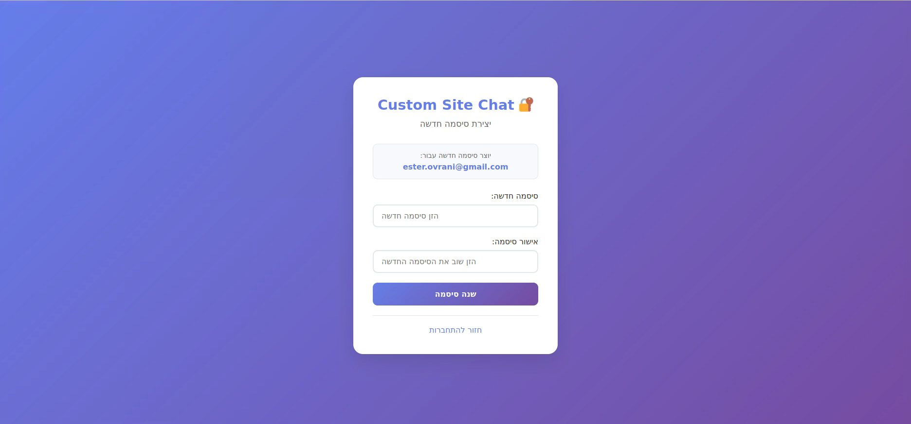

**Steps:**
1. Enter your new password in the second field
2. Confirm the new password in the third field
4. Click **"Reset Password"** button

### 6.4 Password Reset Success

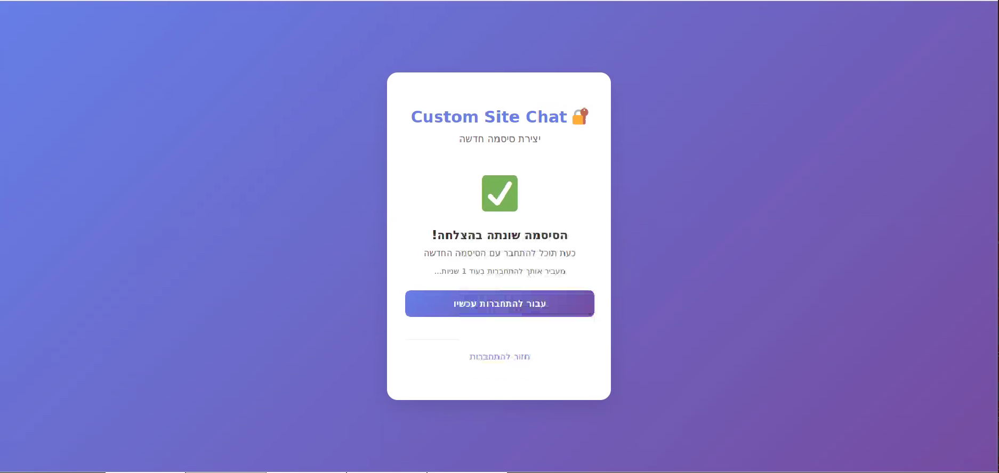

✓ Password successfully reset - you can now log in with the new password.

---

## 7. Using the Chat Widget

### 7.1 Chat Widget Button

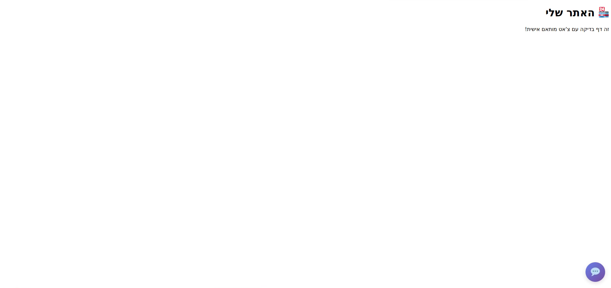

**Steps:**
1. Look for the floating chat button in the bottom-right corner (red circle highlights it)
2. This is how the widget appears on your website to visitors

### 7.2 Opening Chat

**Steps:**
1. Click the chat button
2. Chat window opens and expands
3. You'll see the welcome message and chat interface

### 7.3 Asking Questions

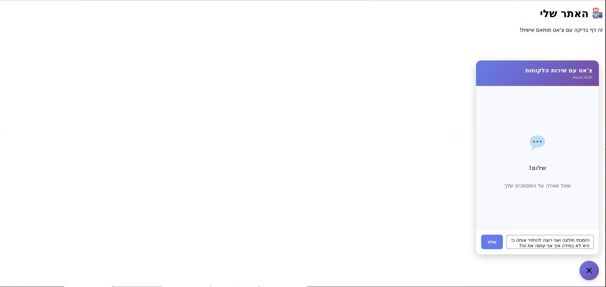

**Steps:**
1. Click in the input field at the bottom (blue arrow points to it)
2. Type your question in natural language **Supported languages:** Hebrew and English (automatic detection)
3. After typing your question
4. Click the send button (green arrow points to it)
5. Or simply press Enter on your keyboard

### 7.3 Bot Response

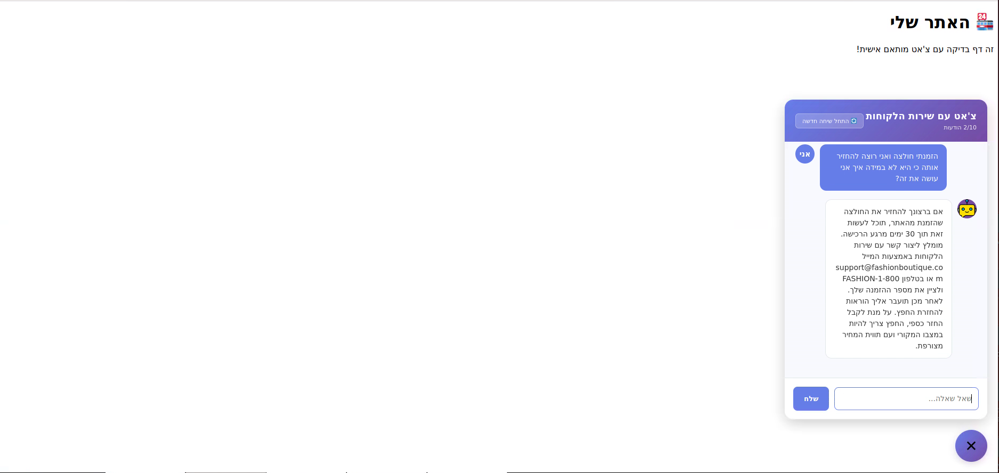

The bot responds with an AI-generated answer based on your uploaded documents.

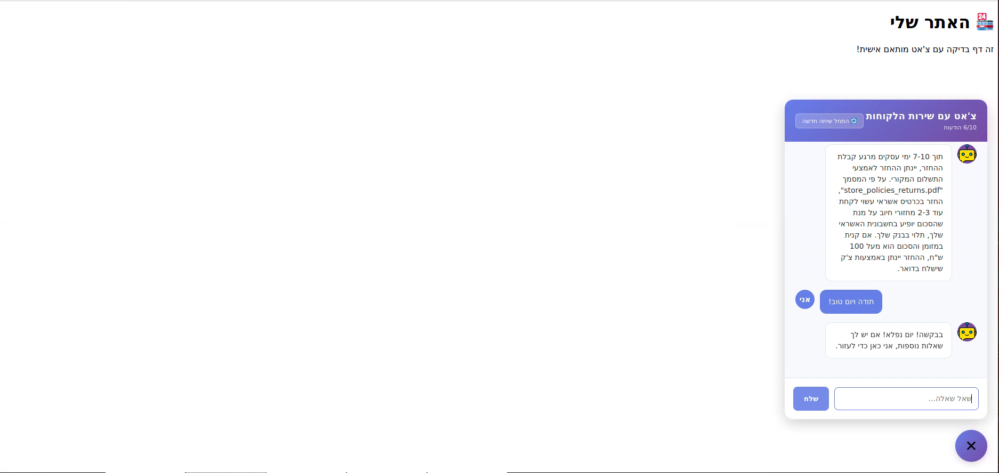

**Response includes:**
1. AI-generated answer at the top
2. Source excerpts from your documents (blue rectangles highlight each source)
3. Relevance scores showing how relevant each source is

### 7.4 Chat Features

The chat is context-aware and remembers your last 10 messages for follow-up questions.
You can continue to ask after you press on the button **התחלת שיחה חדשה**.

**Features:**
- Remembers last 10 messages
- Automatic language detection (Hebrew/English)
- Source citations with every answer
- Natural follow-up questions

### 7.5 Closing Chat

**Steps:**
1. Click the **X** button at the top-right (red arrow points to it)
2. Or click anywhere outside the chat window
3. Chat minimizes back to the floating button

---

## 📊 Quick Reference

| Action | Button Location | Notes |
|--------|----------------|-------|
| **View Document** | My Documents → צפה | Opens PDF in browser |
| **Download Document** | My Documents → הורד | Saves to computer |
| **Delete Document** | My Documents → מחק | Cannot be undone |
| **Upload Document** | My Documents → Upload | PDF only |
| **Copy Secret Key** | Collection Settings | Keep confidential |
| **Copy Embed Code** | Collection Settings | Paste before `</body>` |
| **Logout** | Header → התנתק | End session |

---

## 🆘 Troubleshooting

### Upload Issues
- Ensure PDF is not password-protected
- Use text-based PDFs (not scanned images)
- Check file size limits

### Widget Not Showing
- Verify embed code is before `</body>` tag
- Check browser console for errors (F12)
- Clear browser cache

### Bot Not Answering
- Wait for documents to finish processing
- Ask more specific questions
- Check if information exists in your documents

---

## 📧 Support

**Email**: Ester.Ovrani@gmail.com  
**Documentation**: [API Docs](../backend/docs/)

---

*Last Updated: December 2024 | Version: 1.0*
