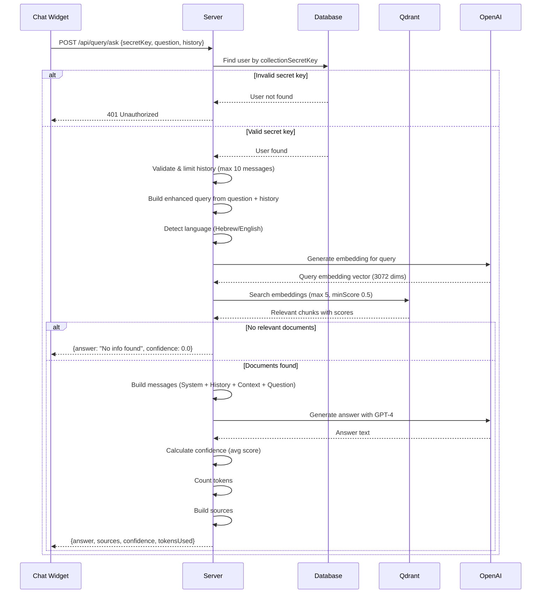

# 💬 Query API Documentation

[← Back to Main README](../README.md)

---

## Overview

The Query API allows public access to ask questions about uploaded documents using a secret key. It supports conversation history and generates AI-powered answers with source citations.

**Base Path:** `/api/query`

**Authentication:** Secret Key (no JWT required)

---

## Ask Question

**Endpoint:** `POST /api/query/ask`

**Authentication:** Secret Key in request body

### Flow Diagram



### Request

```json
POST /api/query/ask
Content-Type: application/json

{
  "secretKey": "sk_a1b2c3d4e5f6g7h8i9j0k1l2m3n4o5p6",
  "question": "What are the payment terms?",
  "history": [
    {
      "role": "user",
      "content": "Tell me about this contract"
    },
    {
      "role": "assistant",
      "content": "This is a service agreement between Company A and Company B..."
    }
  ]
}
```

### Response (With Results)

```json
{
  "success": true,
  "data": {
    "answer": "According to the contract, payment terms are Net 30 days from invoice date. Payments must be made via bank transfer to the account specified in Section 5.2.",
    "sources": [
      {
        "documentName": "contract.pdf",
        "excerpt": "Payment terms: Net 30 days from date of invoice. All payments shall be made by wire transfer...",
        "relevanceScore": 0.89,
        "isPrimary": true
      },
      {
        "documentName": "contract.pdf",
        "excerpt": "Late payments will incur a penalty of 1.5% per month...",
        "relevanceScore": 0.72,
        "isPrimary": false
      }
    ],
    "responseTimeMs": 2340,
    "confidence": 0.805,
    "tokensUsed": 487
  }
}
```

### Response (No Results)

```json
{
  "success": true,
  "data": {
    "answer": "Sorry, I couldn't find relevant information in the documents.",
    "sources": [],
    "responseTimeMs": 450,
    "confidence": 0.0,
    "tokensUsed": 0
  }
}
```

### Response (Invalid Secret Key)

```json
{
  "success": false,
  "error": "Invalid secret key"
}
```

---

## Request Parameters

### `secretKey` (required)

- **Type:** String
- **Description:** User's collection secret key
- **Format:** `sk_` + 32 hexadecimal characters
- **Example:** `sk_a1b2c3d4e5f6g7h8i9j0k1l2m3n4o5p6`

### `question` (required)

- **Type:** String
- **Min Length:** 1
- **Max Length:** 2000
- **Description:** The user's question
- **Example:** `"What are the payment terms?"`

### `history` (optional)

- **Type:** Array of HistoryMessage objects
- **Max Length:** 10 messages (older messages are truncated)
- **Description:** Previous conversation messages for context

#### HistoryMessage Object

```json
{
  "role": "user" | "assistant",
  "content": "Message text"
}
```

---

## Response Fields

### `answer`

- **Type:** String
- **Description:** AI-generated answer to the question
- **Language:** Auto-detected (Hebrew or English)

### `sources`

- **Type:** Array of Source objects
- **Description:** Relevant document excerpts used to generate the answer

#### Source Object

```json
{
  "documentName": "contract.pdf",
  "excerpt": "Excerpt from document (max 200 chars)",
  "relevanceScore": 0.89,
  "isPrimary": true
}
```

| Field | Type | Description |
|-------|------|-------------|
| `documentName` | String | Original filename |
| `excerpt` | String | Text excerpt (truncated to 200 chars) |
| `relevanceScore` | Double | Similarity score (0.0 - 1.0) |
| `isPrimary` | Boolean | Is this the top result? |

### `confidence`

- **Type:** Double (0.0 - 1.0)
- **Description:** Average relevance score of all sources
- **Calculation:** `sum(relevanceScores) / count(sources)`

### `tokensUsed`

- **Type:** Integer
- **Description:** Number of tokens used in the GPT-4 response

### `responseTimeMs`

- **Type:** Long
- **Description:** Total processing time in milliseconds

---

## How It Works

### 1. Query Enhancement

The system combines the current question with recent conversation history to create a more contextual search:

```
Last user message + Current question
```

### 2. Language Detection

Automatically detects if the query is in Hebrew or English based on character analysis:
- Hebrew: `≥30%` Hebrew characters
- English: `<30%` Hebrew characters

### 3. Vector Search

- Converts enhanced query to embedding (3072 dimensions)
- Searches Qdrant for top 5 most relevant chunks
- Minimum relevance score: 0.5

### 4. Answer Generation

System prompt structure:
```
System: "You are a helpful AI assistant. ANSWER IN [LANGUAGE] ONLY!"

[Conversation History]

User: [Document Context] + [Current Question]
```

### 5. Response Processing

- Calculates average confidence score
- Counts tokens used
- Truncates excerpts to 200 characters
- Marks top result as "primary"

---

## Best Practices

### 1. History Management

✅ **Do:**
- Send last 3-5 messages for context
- Include both user and assistant messages
- Keep messages concise

❌ **Don't:**
- Send more than 10 messages (will be truncated)
- Include system messages
- Send empty history array

### 2. Question Formatting

✅ **Do:**
- Ask clear, specific questions
- Use natural language
- Reference previous context when needed

❌ **Don't:**
- Ask multiple questions at once
- Use overly complex sentences
- Include special characters or formatting

### 3. Error Handling

```javascript
try {
  const response = await fetch('/api/query/ask', {
    method: 'POST',
    headers: { 'Content-Type': 'application/json' },
    body: JSON.stringify({ secretKey, question, history })
  });
  
  const data = await response.json();
  
  if (!data.success) {
    // Handle error (invalid secret key, etc.)
    console.error(data.error);
  } else {
    // Display answer and sources
    console.log(data.data.answer);
  }
} catch (error) {
  console.error('Network error:', error);
}
```

---

## Rate Limits

| Resource | Limit |
|----------|-------|
| History Messages | 10 max |
| Relevant Chunks | 5 max |
| Question Length | 2000 chars |
| Min Relevance Score | 0.5 |

---

## Example Integrations

### JavaScript (Fetch API)

```javascript
async function askQuestion(secretKey, question, history = []) {
  const response = await fetch('http://localhost:8080/api/query/ask', {
    method: 'POST',
    headers: {
      'Content-Type': 'application/json'
    },
    body: JSON.stringify({
      secretKey: secretKey,
      question: question,
      history: history
    })
  });
  
  const data = await response.json();
  return data.data;
}

// Usage
const result = await askQuestion(
  'sk_a1b2c3d4...',
  'What are the payment terms?',
  [
    { role: 'user', content: 'Tell me about the contract' },
    { role: 'assistant', content: 'This is a service agreement...' }
  ]
);

console.log(result.answer);
console.log(result.sources);
```

### Python (Requests)

```python
import requests

def ask_question(secret_key, question, history=[]):
    response = requests.post(
        'http://localhost:8080/api/query/ask',
        json={
            'secretKey': secret_key,
            'question': question,
            'history': history
        }
    )
    return response.json()['data']

# Usage
result = ask_question(
    'sk_a1b2c3d4...',
    'What are the payment terms?',
    [
        {'role': 'user', 'content': 'Tell me about the contract'},
        {'role': 'assistant', 'content': 'This is a service agreement...'}
    ]
)

print(result['answer'])
print(result['sources'])
```

### cURL

```bash
curl -X POST http://localhost:8080/api/query/ask \
  -H "Content-Type: application/json" \
  -d '{
    "secretKey": "sk_a1b2c3d4e5f6g7h8i9j0k1l2m3n4o5p6",
    "question": "What are the payment terms?",
    "history": [
      {
        "role": "user",
        "content": "Tell me about this contract"
      },
      {
        "role": "assistant",
        "content": "This is a service agreement..."
      }
    ]
  }'
```

---

## Common Errors

### 401 Unauthorized

```json
{
  "success": false,
  "error": "Invalid secret key"
}
```

**Solution:** Verify the secret key is correct (get it from `/api/collection/info`).

### 400 Validation Error

```json
{
  "success": false,
  "errorCode": "VALIDATION_ERROR",
  "message": "שגיאות ולידציה בנתונים שהוזנו",
  "fieldErrors": {
    "question": "Question is required",
    "secretKey": "Secret key is required"
  }
}
```

**Solution:** Ensure all required fields are provided.

### 500 Internal Server Error

```json
{
  "success": false,
  "errorCode": "EXTERNAL_SERVICE_ERROR",
  "message": "שגיאה בשירות Vector Database: Connection timeout"
}
```

**Solution:** Check if Qdrant and OpenAI services are running.

---

[← Back to Main README](../README.md)
