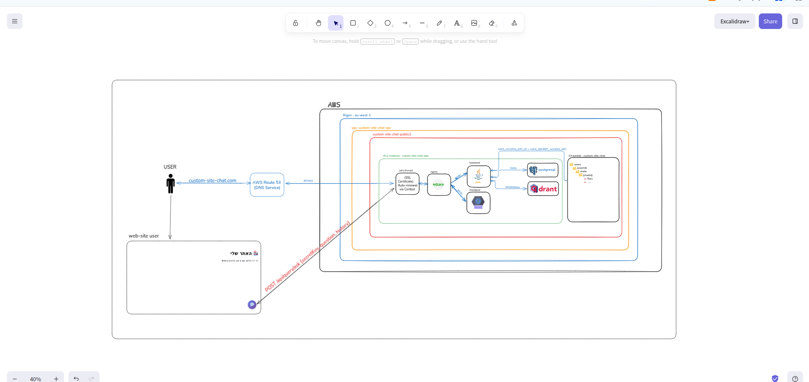

# ☁️ AWS Architecture

Complete AWS infrastructure and deployment guide for Custom Site Chat.

---

## 📊 Architecture Overview



---

## 🏗️ AWS Components

### 1. EC2 Instance

**Instance Type**: `t3.medium`

| Specification | Value |
|--------------|-------|
| vCPUs | 2 |
| Memory | 4 GB |
| Storage | 30 GB (gp3 SSD) |
| OS | Ubuntu 22.04 LTS |
| Region | eu-west-1 (Ireland) |

**Why t3.medium?**
- Balanced CPU/memory for Spring Boot
- Burstable performance (cost-effective)
- Handles moderate traffic well
- Can scale to t3.large if needed

**Monthly Cost**: ~$30

---

### 2. Elastic IP

**Purpose**: Static public IP that doesn't change when instance restarts

**Benefits**:
- Consistent DNS configuration
- Easy IP whitelisting
- Professional setup

**Cost**: Free when attached to running instance

---

### 3. Route 53 (DNS)

**Domain**: `custom-site-chat.com`

**DNS Records**:
```
A Record: custom-site-chat.com → Elastic IP
```

**Monthly Cost**: ~$0.50

---

### 4. AWS S3 Bucket

**Bucket Name**: `custom-site-chat-files`

**Configuration**:
- **Region**: eu-west-1
- **Versioning**: Disabled
- **Encryption**: AES-256 (Server-side)
- **Public Access**: Blocked (private)

**Folder Structure**:
```
custom-site-chat-files/
└── user-{userId}/
    ├── {documentId}-{filename}.pdf
    └── ...
```

**IAM Policy** (Backend Access):
```json
{
  "Version": "2012-10-17",
  "Statement": [
    {
      "Effect": "Allow",
      "Action": [
        "s3:PutObject",
        "s3:GetObject",
        "s3:DeleteObject"
      ],
      "Resource": "arn:aws:s3:::custom-site-chat-files/*"
    }
  ]
}
```

**Monthly Cost**: ~$0.23 per GB

---

### 5. Security Group

**Inbound Rules**:
| Type | Protocol | Port | Source | Description |
|------|----------|------|--------|-------------|
| HTTPS | TCP | 443 | 0.0.0.0/0 | Public HTTPS |
| HTTP | TCP | 80 | 0.0.0.0/0 | Redirect to HTTPS |
| SSH | TCP | 22 | Your IP | Admin access only |

**Outbound Rules**: All traffic allowed

---

### 6. SSL/TLS Certificate

**Provider**: Let's Encrypt (Free)
- **Validity**: 90 days
- **Auto-renewal**: Via cron job
- **Encryption**: TLS 1.2, TLS 1.3

---

## 🚀 Deployment Guide

### Step 1: Launch EC2 Instance

1. Go to AWS Console → EC2 → Launch Instance
2. Choose AMI: Ubuntu Server 22.04 LTS
3. Instance Type: t3.medium
4. Storage: 30 GB gp3
5. Create Security Group (rules above)
6. Create/Download Key Pair
7. Launch Instance

---

### Step 2: Allocate Elastic IP

1. EC2 → Elastic IPs → Allocate
2. Associate with your instance
3. Note the IP address

---

### Step 3: Configure DNS

1. Go to your domain registrar
2. Create A Record:
   ```
   custom-site-chat.com → Your Elastic IP
   ```
3. Wait for DNS propagation (5-30 minutes)

---

### Step 4: Connect to Instance

```bash
# Change key permissions
chmod 400 your-key.pem

# Connect
ssh -i your-key.pem ubuntu@custom-site-chat.com
```

---

### Step 5: Run Deployment Script

**Upload script**:
```bash
scp -i your-key.pem ./prodaction/aws_deploy_script.sh ubuntu@custom-site-chat.com:~/
```

**On EC2**:
```bash
chmod +x aws_deploy_script.sh
sudo ./aws_deploy_script.sh
```

**Script does**:
1. Updates system
2. Installs Docker & Docker Compose
3. Installs Certbot (SSL)
4. Creates project structure
5. **Pauses for .env configuration**
6. Obtains SSL certificate
7. Starts containers
8. Setups auto-renewal

---

### Step 6: Configure .env File

When script pauses:

```bash
cp .env.example .env
nano .env
```

**Required values**:
```bash
POSTGRES_PASSWORD=your-secure-password
JWT_SECRET_KEY=your-256-bit-secret-key
MAIL_USERNAME=your-email@gmail.com
MAIL_PASSWORD=gmail-app-password
OPENAI_API_KEY=sk-your-key
AWS_ACCESS_KEY_ID=AKIA...
AWS_SECRET_ACCESS_KEY=...
AWS_S3_BUCKET=custom-site-chat-files
GOOGLE_CLIENT_ID=...apps.googleusercontent.com
GOOGLE_CLIENT_SECRET=...
FRONTEND_URL=https://custom-site-chat.com

# IMPORTANT!
TEST_MODE_ENABLED=false
BYPASS_EMAIL_VERIFICATION=false
```

Save and press Enter to continue.

---

### Step 7: Verify Deployment

```bash
# Check containers
docker-compose ps

# Test health
curl https://custom-site-chat.com/auth/status
```

---

## 🔄 Updating Application

```bash
ssh -i your-key.pem ubuntu@custom-site-chat.com
cd /home/ubuntu/custom-site-chat

# Pull latest images
docker-compose pull

# Restart
docker-compose down
docker-compose up -d

# Verify
docker-compose logs -f --tail=100
```

---

## 💰 Cost Breakdown

| Service | Monthly Cost |
|---------|--------------|
| EC2 t3.medium | $30 |
| EBS 30GB | $2.40 |
| S3 Storage | $0.23 |
| Data Transfer | $5-10 |
| Route 53 | $0.50 |
| **Total** | **~$38-43/month** |

---

## 🔧 Maintenance

### SSL Renewal

**Automatic**: Daily at 3 AM

**Manual**:
```bash
sudo certbot renew
docker-compose restart nginx
```

### Database Backup

```bash
# Backup
docker exec postgres-custom-site-chat pg_dump -U sitechat_user customsitechat | gzip > backup-$(date +%Y%m%d).sql.gz

# Restore
gunzip < backup.sql.gz | docker exec -i postgres-custom-site-chat psql -U sitechat_user customsitechat
```

---

## ⚠️ Troubleshooting

### Can't connect to website
```bash
# Check instance
aws ec2 describe-instances

# Check DNS
dig custom-site-chat.com

# Check nginx
docker-compose ps nginx
```

### Backend not responding
```bash
docker-compose logs backend
curl http://localhost:8080/auth/status
docker-compose restart backend
```

### Out of disk space
```bash
df -h
docker system prune -a
docker volume prune
```

---

**Last Updated**: 2025-01-15  
**Maintained by**: Ester Ovrani
