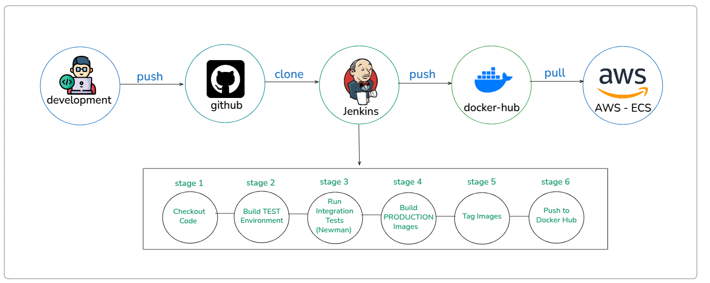

# 🔄 CI/CD Pipeline

Complete CI/CD pipeline documentation with Jenkins setup and Newman testing.

---

## 🎯 Pipeline Overview

```
Developer → GitHub → Jenkins → Tests → Build → Docker Hub → AWS EC2
```

**Process**:
1. Developer pushes code to GitHub
2. GitHub webhook triggers Jenkins
3. Jenkins builds test environment
4. Newman runs API tests
5. If tests pass → Build production images
6. Tag with commit message
7. Push to Docker Hub
8. Manual deployment to AWS

---

## 🏗️ Pipeline Architecture



---

## 🚀 Jenkins Setup Guide

### Prerequisites

- Docker & Docker Compose installed
- GitHub repository
- Docker Hub account

---

### Step 1: Create Jenkins Directory

```bash
mkdir -p jenkins
cd jenkins
```

---

### Step 2: Create Jenkins Dockerfile

**File**: `jenkins/Dockerfile`

```dockerfile
FROM jenkins/jenkins:lts

USER root

# Install Docker CLI
RUN apt-get update && \
    apt-get install -y apt-transport-https ca-certificates curl gnupg lsb-release && \
    curl -fsSL https://download.docker.com/linux/debian/gpg | gpg --dearmor -o /usr/share/keyrings/docker-archive-keyring.gpg && \
    echo "deb [arch=$(dpkg --print-architecture) signed-by=/usr/share/keyrings/docker-archive-keyring.gpg] https://download.docker.com/linux/debian $(lsb_release -cs) stable" | tee /etc/apt/sources.list.d/docker.list > /dev/null && \
    apt-get update && \
    apt-get install -y docker-ce-cli docker-compose-plugin

USER jenkins
```

---

### Step 3: Create Docker Compose for Jenkins

**File**: `jenkins/docker-compose.jenkins.yml`

```yaml
version: '3.8'
services:
  jenkins:
    build: .
    container_name: jenkins
    privileged: true
    user: root
    ports:
      - "8090:8080"
      - "50000:50000"
    volumes:
      - jenkins_home:/var/jenkins_home
      - /var/run/docker.sock:/var/run/docker.sock
    environment:
      - DOCKER_HOST=unix:///var/run/docker.sock
    restart: unless-stopped

volumes:
  jenkins_home:
    driver: local
```

---

### Step 4: Start Jenkins

```bash
docker-compose -f docker-compose.jenkins.yml up -d
```

---

### Step 5: Initial Configuration

**Get admin password**:
```bash
docker exec jenkins cat /var/jenkins_home/secrets/initialAdminPassword
```

**Access Jenkins**: http://localhost:8090

1. Paste admin password
2. Install suggested plugins
3. Create admin user
4. Finish setup

---

### Step 6: Install Additional Plugins

**Manage Jenkins** → **Manage Plugins** → **Available**

Install:
- ☑️ Docker Pipeline
- ☑️ GitHub Integration
- ☑️ Pipeline
- ☑️ Credentials Binding

Restart Jenkins after installation.

---

### Step 7: Configure Credentials

**Manage Jenkins** → **Credentials** → **Global** → **Add Credentials**

**Add 3 Credentials**:

#### 1. Docker Hub Credentials
- **Kind**: Username with password
- **Scope**: Global
- **Username**: Your Docker Hub username
- **Password**: Your Docker Hub password
- **ID**: `docker-registry-credentials`
- **Description**: Docker Hub Login

#### 2. Test Environment File
- **Kind**: Secret file
- **Scope**: Global
- **File**: Upload `.env` with `TEST_MODE_ENABLED=true`
- **ID**: `env-file-test`
- **Description**: Test Environment Variables

#### 3. Production Environment File
- **Kind**: Secret file
- **Scope**: Global
- **File**: Upload `.env` with `TEST_MODE_ENABLED=false`
- **ID**: `env-file-prod`
- **Description**: Production Environment Variables

---

### Step 8: Create Pipeline Job

1. **Dashboard** → **New Item**
2. **Name**: Custom-Site-Chat-Pipeline
3. **Type**: Pipeline
4. **OK**

**Configure Pipeline**:

**General**:
- **Description**: CI/CD Pipeline for Custom Site Chat

**Build Triggers**:
- ☑️ GitHub hook trigger for GITScm polling

**Pipeline**:
- **Definition**: Pipeline script from SCM
- **SCM**: Git
- **Repository URL**: `https://github.com/yourusername/custom-site-chat.git`
- **Branch**: `*/main`
- **Script Path**: `Jenkinsfile`

**Save**

---

### Step 9: Setup GitHub Webhook

1. Go to GitHub repository
2. **Settings** → **Webhooks** → **Add webhook**
3. **Payload URL**: `http://your-jenkins-url:8090/github-webhook/`
4. **Content type**: `application/json`
5. **Which events**: Just the push event
6. **Active**: ✓
7. **Add webhook**

---

## 📋 Pipeline Stages Explained

### Stage 1: Display Build Info 📋

**Purpose**: Show Git information

```groovy
echo "Git Commit Message: ${GIT_COMMIT_MESSAGE}"
echo "Git Commit Hash: ${GIT_COMMIT_SHORT}"
echo "Image Tag: ${IMAGE_TAG}"
```

**Output**:
```
Git Commit Message: fix-login-bug
Git Commit Hash: a3f2b1c
Image Tag: fix-login-bug-a3f2b1c
```

---

### Stage 2: Cleanup Old Containers 🧹

**Purpose**: Clean workspace, preserve Jenkins

```bash
# Stop all containers except Jenkins
docker ps -aq | grep -v ${JENKINS_CONTAINER_ID} | xargs -r docker stop

# Remove old images
docker images | grep -E "backend|frontend" | xargs -r docker rmi -f
```

**Important**: Jenkins container is preserved!

---

### Stage 3: Checkout 📥

**Purpose**: Pull latest code from Git

```groovy
checkout scm
```

---

### Stage 4: Create TEST .env 🔐

**Purpose**: Load test environment variables

```groovy
withCredentials([file(credentialsId: 'env-file-test', variable: 'ENV_FILE')]) {
    sh 'cp "${ENV_FILE}" .env'
}
```

**Verifies**:
- ✅ `TEST_MODE_ENABLED=true`
- ✅ `BYPASS_EMAIL_VERIFICATION=true`
- ✅ `FIXED_VERIFICATION_CODE=999999`

---

### Stage 5: Build TEST Environment 🏗️

**Purpose**: Build all images including Newman

```bash
docker-compose -f docker-compose.test.yml build --no-cache
```

**Images built**:
- backend-test
- frontend-test
- postgres
- qdrant
- nginx
- newman

**Duration**: ~2 minutes

---

### Stage 6: Start TEST & Run Tests 🚀

**Purpose**: Run Newman API tests

```bash
# Start services
docker-compose -f docker-compose.test.yml up -d postgres qdrant backend frontend nginx

# Wait for backend health
docker-compose -f docker-compose.test.yml up -d --wait backend

# Run Newman tests
docker-compose -f docker-compose.test.yml up newman
```

**Health Check**:
```bash
curl -f http://localhost:8080/auth/status
```

**Newman tests**: 60+ assertions across 10 test suites

**Duration**: ~1 minute

---

### Stage 7: Cleanup TEST Environment 🗑️

**Purpose**: Remove test containers

```bash
docker-compose -f docker-compose.test.yml down -v
```

Removes:
- All test containers
- Test volumes
- Test networks

---

### Stage 8: Create PRODUCTION .env 🔐

**Purpose**: Load production environment

```groovy
withCredentials([file(credentialsId: 'env-file-prod', variable: 'ENV_FILE')]) {
    sh 'cp "${ENV_FILE}" .env'
}
```

**CRITICAL CHECKS**:
- ✅ `TEST_MODE_ENABLED=false` (or not present)
- ✅ `BYPASS_EMAIL_VERIFICATION=false` (or not present)

**Pipeline FAILS if**:
- ❌ `TEST_MODE_ENABLED=true` found
- ❌ `BYPASS_EMAIL_VERIFICATION=true` found

---

### Stage 9: Build PRODUCTION Images 🏗️

**Purpose**: Build clean production images

```bash
docker-compose build --no-cache backend frontend
```

**Images**:
- backend-prod:latest
- frontend-prod:latest

**Duration**: ~3 minutes

---

### Stage 10: Verify Production Images 🔍

**Purpose**: Security validation

```bash
docker run --rm --entrypoint env backend-prod:latest > /tmp/backend-env.txt

# Check for TEST_MODE
if grep -q "TEST_MODE_ENABLED=true" /tmp/backend-env.txt; then
    echo "❌ CRITICAL ERROR"
    exit 1
fi
```

---

### Stage 11: Tag Production Images 📦

**Purpose**: Version tracking

```bash
# Tag with commit message
docker tag backend-prod:latest esterovrani/custom-site-chat-backend:${IMAGE_TAG}

# Also tag as latest
docker tag backend-prod:latest esterovrani/custom-site-chat-backend:latest
```

**Example tags**:
```
esterovrani/custom-site-chat-backend:fix-login-bug-a3f2b1c
esterovrani/custom-site-chat-backend:latest
```

---

### Stage 12: Deploy to Registry 🚢

**Purpose**: Push to Docker Hub

```bash
echo "${DOCKER_PASS}" | docker login -u "${DOCKER_USER}" --password-stdin

docker push esterovrani/custom-site-chat-backend:${IMAGE_TAG}
docker push esterovrani/custom-site-chat-backend:latest

docker push esterovrani/custom-site-chat-frontend:${IMAGE_TAG}
docker push esterovrani/custom-site-chat-frontend:latest
```

**Duration**: ~30 seconds

---

## 🧪 Newman API Testing

### Test Structure

```
tests/
├── Dockerfile
└── newman/
    ├── collections/
    │   └── custom-site-chat.postman_collection.json
    ├── environments/
    │   └── test.postman_environment.json
    └── data/
        └── EsterOvrani.pdf
```

---

### Newman Dockerfile

```dockerfile
FROM postman/newman:alpine

RUN mkdir -p /etc/newman/collections /etc/newman/environments /etc/newman/data

COPY newman/collections/custom-site-chat.postman_collection.json /etc/newman/collections/
COPY newman/environments/test.postman_environment.json /etc/newman/environments/
COPY newman/data/EsterOvrani.pdf /etc/newman/data/

WORKDIR /etc/newman
```

---

### Test Flow

```
1. Health Check
   └─> Verify backend is running

2. User Registration
   └─> Create test user with unique email
   └─> Verify registration response

3. Email Verification
   └─> Use fixed code (999999)
   └─> Get JWT token

4. Login
   └─> Test with valid credentials
   └─> Test with invalid credentials

5. Collection Management
   └─> Get collection info
   └─> Get secret key
   └─> Get embed code
   └─> Regenerate secret key

6. Document Upload
   └─> Upload test PDF
   └─> Wait 15 seconds
   └─> Verify processing

7. Document Management
   └─> Get document list
   └─> Get single document
   └─> Get download URL

8. Query API
   └─> Ask question with valid key
   └─> Test with invalid key
   └─> Test with conversation history

9. Password Reset
   └─> Request reset
   └─> Verify reset code

10. Cleanup
    └─> Delete document
    └─> Logout
```

---

### Test Coverage

| Category | Tests |
|----------|-------|
| Authentication | 12 |
| Document Management | 15 |
| Collection API | 8 |
| Query API | 10 |
| Error Handling | 8 |
| Password Reset | 3 |
| User API | 4 |
| **Total** | **60+** |

---

### Sample Test

```javascript
pm.test('Status code is 200', function () {
    pm.response.to.have.status(200);
});

pm.test('Login successful', function () {
    const jsonData = pm.response.json();
    pm.expect(jsonData.success).to.be.true;
    pm.expect(jsonData.token).to.be.a('string');
    
    // Save token for next requests
    pm.collectionVariables.set('authToken', jsonData.token);
});
```

---

## 📊 Pipeline Metrics

| Stage | Duration | Success Rate |
|-------|----------|--------------|
| Checkout | 10s | 99% |
| Build Test | 2 min | 98% |
| Run Tests | 1 min | 95% |
| Build Prod | 3 min | 99% |
| Push Images | 30s | 98% |
| **Total** | **~7 min** | **95%** |

---

## 🏷️ Image Tagging Strategy

### Format

```
{sanitized-commit-message}-{commit-hash}
```

### Sanitization Rules

```bash
# Original: "Fix: Login bug #123"
# Sanitized: "fix-login-bug-123"

# Steps:
1. Remove special characters
2. Convert to lowercase
3. Replace spaces with hyphens
4. Remove duplicate hyphens
5. Trim to 50 characters
6. Append 7-char commit hash
```

### Examples

| Commit Message | Tag |
|---------------|-----|
| "Fix login bug" | fix-login-bug-a3f2b1c |
| "Add document sorting" | add-document-sorting-b4e3c2d |
| "Update README.md" | update-readme-md-c5d4e3f |

---

## 📧 Notifications

### Success Notification

```
✅ BUILD SUCCESS - #42

Branch: main
Commit: a3f2b1c - "Fix login bug"
Author: Ester Ovrani

Images Pushed:
- esterovrani/custom-site-chat-backend:fix-login-bug-a3f2b1c
- esterovrani/custom-site-chat-frontend:fix-login-bug-a3f2b1c

Ready for deployment to AWS.
```

### Failure Notification

```
❌ BUILD FAILED - #43

Stage: Run Newman Tests
Reason: 3 API test assertions failed

Failed Tests:
- Login with valid credentials
- Upload document
- Ask question

Console: http://jenkins:8090/job/custom-site-chat/43/console
```

---

## 🚀 Manual Deployment to AWS

After Jenkins pushes to Docker Hub:

```bash
# 1. SSH to EC2
ssh -i your-key.pem ubuntu@custom-site-chat.com

# 2. Navigate to project
cd /home/ubuntu/custom-site-chat

# 3. Pull latest images
docker-compose pull

# 4. Restart containers
docker-compose down
docker-compose up -d

# 5. Verify deployment
docker-compose ps
docker-compose logs -f --tail=100

# 6. Test application
curl https://custom-site-chat.com/auth/status
```

---

## 🔧 Troubleshooting

### Issue 1: Newman Tests Fail

**Check logs**:
```bash
docker-compose -f docker-compose.test.yml logs newman
docker-compose -f docker-compose.test.yml logs backend
```

**Common causes**:
- Backend not healthy
- Database connection failed
- OpenAI API key invalid
- Test PDF file missing

**Solution**:
```bash
# Verify backend health
curl http://localhost:8080/auth/status

# Check environment variables
docker-compose -f docker-compose.test.yml exec backend env | grep TEST_MODE
```

---

### Issue 2: Docker Build Fails

**Symptoms**: "Error building image"

**Solutions**:
```bash
# Clear Docker cache
docker system prune -a -f
docker builder prune -a -f

# Check disk space
df -h

# Rebuild
docker-compose build --no-cache
```

---

### Issue 3: Push to Docker Hub Fails

**Symptoms**: "unauthorized" or "denied"

**Solutions**:
```bash
# Re-login
docker login

# Check credentials in Jenkins
# Manage Jenkins → Credentials → Update docker-registry-credentials

# Manual test
docker push esterovrani/custom-site-chat-backend:latest
```

---

### Issue 4: Jenkins Container Deleted

**Symptoms**: "Error: No such container: jenkins"

**Prevention**:
```bash
# Jenkinsfile preserves Jenkins by:
JENKINS_CONTAINER_ID=$(hostname)
docker ps -aq | grep -v ${JENKINS_CONTAINER_ID} | xargs -r docker rm -f
```

**If deleted**:
```bash
cd jenkins
docker-compose -f docker-compose.jenkins.yml up -d
# Wait for Jenkins to start
# Reconfigure pipeline
```

---

## 🎯 Best Practices

### ✅ Do's

1. **Run all tests** before production build
2. **Use fixed verification code** (999999) in test mode
3. **Verify TEST_MODE=false** in production .env
4. **Tag images** with commit messages
5. **Clean up** test containers after tests
6. **Preserve Jenkins** container during cleanup
7. **Use Secret Files** for environment variables
8. **Monitor pipeline** metrics

### ❌ Don'ts

1. ❌ Skip tests to save time
2. ❌ Use test mode in production
3. ❌ Hardcode secrets in Jenkinsfile
4. ❌ Deploy without verification
5. ❌ Leave test containers running
6. ❌ Use same .env for test/prod
7. ❌ Delete Jenkins container
8. ❌ Push untagged images

---

## 📈 Future Improvements

- [ ] **Automated AWS Deployment** - SSH plugin
- [ ] **Blue-Green Deployment** - Zero downtime
- [ ] **Rollback Strategy** - Quick revert
- [ ] **Slack Notifications** - Real-time alerts
- [ ] **Performance Tests** - Load testing (k6)
- [ ] **Security Scanning** - Trivy/Snyk
- [ ] **Code Coverage** - JaCoCo reports
- [ ] **Parallel Execution** - Faster builds

---

## 📚 References

- [Jenkins Documentation](https://www.jenkins.io/doc/)
- [Newman CLI](https://learning.postman.com/docs/running-collections/using-newman-cli/)
- [Docker Pipeline Plugin](https://plugins.jenkins.io/docker-workflow/)
- [Postman Collections](https://www.postman.com/collection/)

---

**Last Updated**: 2025-01-15  
**Maintained by**: Ester Ovrani  
**Version**: 1.0
