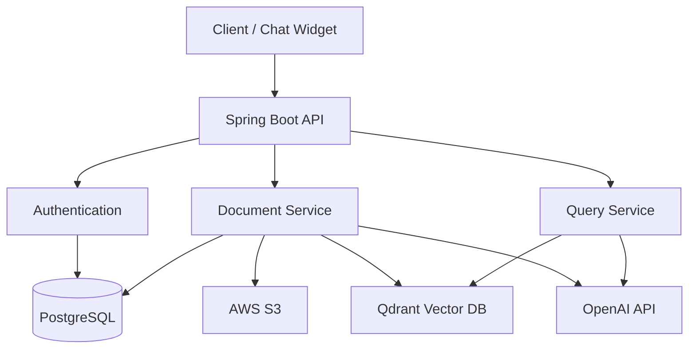

# Custom Site Chat - Backend API Documentation

> **Smart Document-Based Chat System with Vector Search**

A Spring Boot application that allows users to upload PDF documents, process them with AI embeddings, and query them using natural language through a chat interface.

---

## 🚀 Quick Start

```bash
# 1. Configure environment
cp .env.example .env
# Edit .env with your credentials

# 2. Start services
docker-compose up -d  # PostgreSQL + Qdrant

# 3. Run application
./mvnw spring-boot:run

# Server runs on: http://localhost:8080
```

---

## 📚 Architecture Overview



---

## 📖 API Documentation by Module

### 🔐 [Authentication APIs](./docs/AUTH_API.md)
Complete authentication flow including:
- Google OAuth login
- Email/Password registration & login
- Email verification
- Password reset
- Status checks

[**→ View Authentication API Documentation**](./docs/AUTH_API.md)

---

### 👤 [User APIs](./docs/USER_API.md)
User management endpoints:
- Get current user details
- List all users (admin)

[**→ View User API Documentation**](./docs/USER_API.md)

---

### 📦 [Collection APIs](./docs/COLLECTION_API.md)
Qdrant collection management:
- Get collection info
- Regenerate secret key
- Get embed code

[**→ View Collection API Documentation**](./docs/COLLECTION_API.md)

---

### 📄 [Document APIs](./docs/DOCUMENT_API.md)
Document upload and management:
- Upload PDF (with async processing)
- List/Get documents
- Download/View
- Delete
- Reorder

[**→ View Document API Documentation**](./docs/DOCUMENT_API.md)

---

### 💬 [Query API](./docs/QUERY_API.md)
Public chat API for querying documents:
- Ask questions (with conversation history)
- Get AI-generated answers
- Receive relevant sources

[**→ View Query API Documentation**](./docs/QUERY_API.md)

---

## 🛠 Technology Stack

| Component | Technology | Purpose |
|-----------|-----------|---------|
| **Framework** | Spring Boot 3.3.4 | Backend framework |
| **Language** | Java 21 | Programming language |
| **Database** | PostgreSQL | User & document metadata |
| **Vector DB** | Qdrant | Document embeddings storage |
| **Storage** | AWS S3 | PDF file storage |
| **AI Model** | OpenAI text-embedding-3-large | Document embeddings |
| **Chat Model** | OpenAI GPT-4 | Answer generation |
| **Authentication** | JWT + BCrypt | Secure authentication |
| **OAuth** | Google OAuth 2.0 | Social login |
| **PDF Parser** | Apache PDFBox | Text extraction |
| **Async** | Spring @Async | Background processing |

---

## 📊 Key Features

### ✨ Authentication
- ✅ Multiple auth methods (Email, Google OAuth)
- ✅ Email verification with 6-digit codes
- ✅ Secure password reset flow
- ✅ JWT-based sessions

### 📄 Document Processing
- ✅ Async PDF upload & processing
- ✅ Real-time progress tracking (7 stages)
- ✅ Automatic text extraction
- ✅ Smart chunking (500 chars, 50 overlap)
- ✅ Vector embeddings (3072 dimensions)

### 💬 Smart Query System
- ✅ Natural language questions
- ✅ Conversation history support
- ✅ Multi-language (Hebrew/English)
- ✅ Relevance-based answers
- ✅ Source citations

### 🔒 Security
- ✅ JWT authentication
- ✅ User-isolated collections
- ✅ Secret key for public API
- ✅ Soft-delete architecture

---

## 📁 Project Structure

```
backend/
├── src/main/java/com/example/backend/
│   ├── auth/                    # Authentication module
│   │   ├── controller/         # Auth endpoints
│   │   ├── service/            # Auth logic
│   │   └── dto/                # Auth DTOs
│   │
│   ├── user/                   # User management
│   │   ├── model/              # User entity
│   │   ├── repository/         # User DB access
│   │   └── service/            # User operations
│   │
│   ├── collection/             # Collection management
│   │   ├── controller/         # Collection endpoints
│   │   ├── service/            # Collection logic
│   │   └── dto/                # Collection DTOs
│   │
│   ├── document/               # Document processing
│   │   ├── controller/         # Document endpoints
│   │   ├── service/            # Document logic
│   │   ├── model/              # Document entity
│   │   ├── repository/         # Document DB access
│   │   ├── mapper/             # Entity-DTO mapping
│   │   └── dto/                # Document DTOs
│   │
│   ├── query/                  # Query API
│   │   ├── controller/         # Query endpoint
│   │   ├── service/            # Query logic
│   │   └── dto/                # Query DTOs
│   │
│   ├── common/                 # Shared components
│   │   ├── exception/          # Custom exceptions
│   │   ├── dto/                # Common DTOs
│   │   ├── filter/             # JWT filter
│   │   └── infrastructure/     # External services
│   │       ├── email/          # Email service
│   │       ├── storage/        # S3 service
│   │       ├── vectordb/       # Qdrant service
│   │       └── document/       # Document chunking
│   │
│   └── config/                 # Configuration
│       ├── SecurityConfiguration.java
│       ├── QdrantConfig.java
│       ├── AsyncConfig.java
│       └── ...
│
├── src/main/resources/
│   └── application.properties
|_
```

---

## 🔧 Environment Configuration

Create a `.env` file with these variables:

```bash
# Database
POSTGRES_HOST=localhost
POSTGRES_PORT=5432
POSTGRES_DB=customsitechat
POSTGRES_USER=your_user
POSTGRES_PASSWORD=your_password

# JWT
JWT_SECRET_KEY=your-super-secret-jwt-key-min-256-bits
JWT_EXPIRATION_MS=3600000

# Email
MAIL_HOST=smtp.gmail.com
MAIL_PORT=587
MAIL_USERNAME=your-email@gmail.com
MAIL_PASSWORD=your-app-specific-password

# OpenAI
OPENAI_API_KEY=sk-your-openai-api-key-here

# AWS S3
AWS_ACCESS_KEY_ID=your-aws-access-key
AWS_SECRET_ACCESS_KEY=your-aws-secret-key
AWS_REGION=eu-west-1
AWS_S3_BUCKET=custom-site-chat

# Google OAuth
GOOGLE_CLIENT_ID=your-client-id.apps.googleusercontent.com
GOOGLE_CLIENT_SECRET=your-client-secret

# Qdrant
QDRANT_HOST=localhost
QDRANT_GRPC_PORT=6334

# Frontend
FRONTEND_URL=http://localhost:3000
```

---

## 📈 Rate Limits & Constraints

| Resource | Limit | Description |
|----------|-------|-------------|
| File Upload | 50 MB | Maximum PDF file size |
| History Messages | 10 | Max chat history in query |
| Relevant Chunks | 5 | Max chunks from Qdrant |
| JWT Expiration | 1 hour | Token validity |
| Verification Code | 15 min | Email code expiry |

---

## ⚠️ Common Error Codes

| Code | Status | Description |
|------|--------|-------------|
| `AUTHENTICATION_FAILED` | 401 | Invalid credentials |
| `INVALID_TOKEN` | 401 | JWT expired/invalid |
| `ACCESS_DENIED` | 403 | No permission |
| `RESOURCE_NOT_FOUND` | 404 | Entity not found |
| `DUPLICATE_RESOURCE` | 409 | Email/username exists |
| `VALIDATION_ERROR` | 400 | Input validation failed |
| `FILE_TOO_LARGE` | 400 | File exceeds limit |
| `EXTERNAL_SERVICE_ERROR` | 503 | S3/Qdrant/OpenAI error |

---

## 🧪 Testing

```bash
# Run all tests
./mvnw test

# Run specific test
./mvnw test -Dtest=DocumentServiceTest

# With coverage
./mvnw clean test jacoco:report
```

---

## 📦 Building for Production

```bash
# Build JAR
./mvnw clean package -DskipTests

# Build Docker image
docker build -t custom-site-chat-backend .

# Run container
docker run -p 8080:8080 --env-file .env custom-site-chat-backend
```

---

## 🤝 Contributing

1. Fork the repository
2. Create a feature branch (`git checkout -b feature/amazing-feature`)
3. Commit your changes (`git commit -m 'Add amazing feature'`)
4. Push to the branch (`git push origin feature/amazing-feature`)
5. Open a Pull Request

---

## 📝 License

This project is licensed under the MIT License.

---

## 📧 Support

For questions or issues:
- 📖 Check the [detailed API documentation](./docs/)
- 🐛 Open an issue on GitHub
- 💬 Contact: your-email@example.com

---

**Version:** 1.0  
**Last Updated:** 2025-01-15  
**Backend Port:** 8080