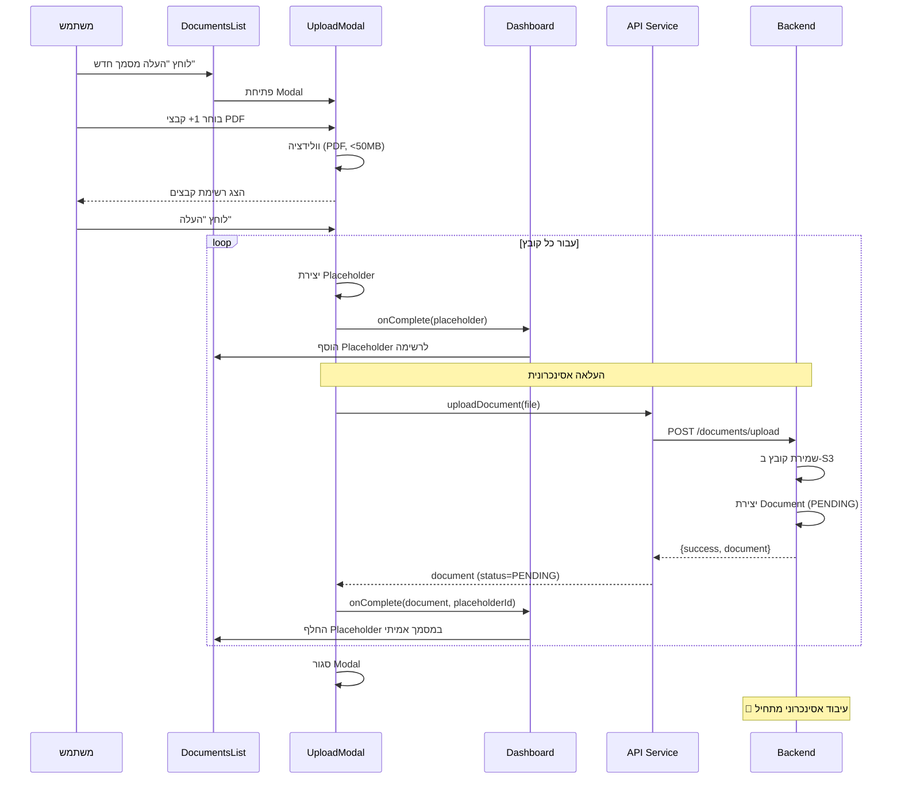
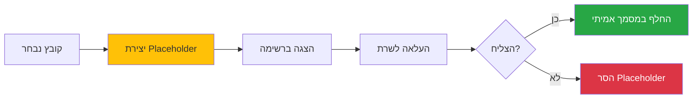
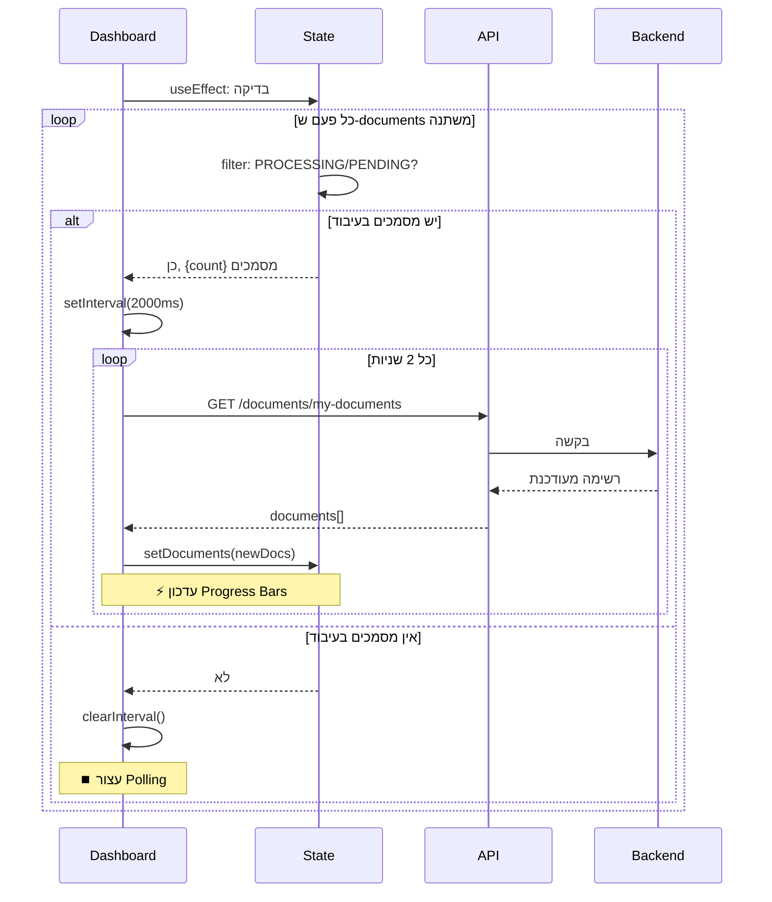
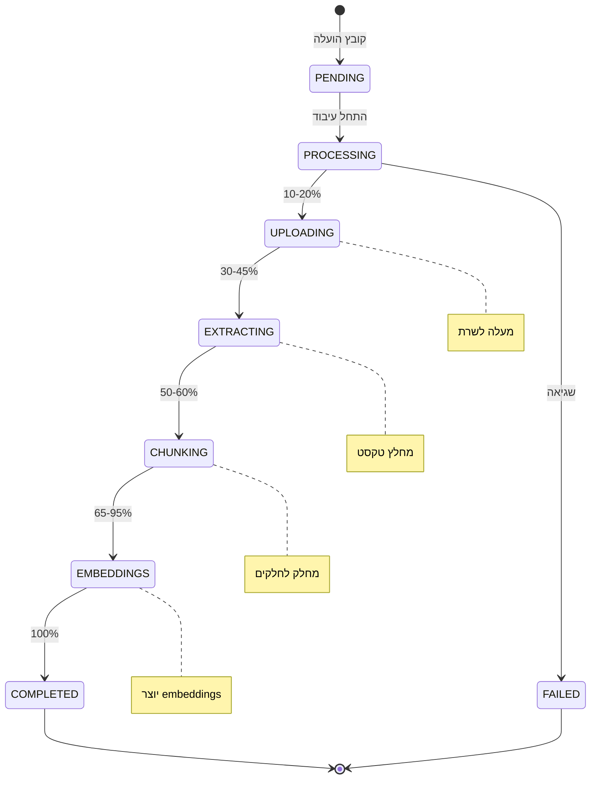
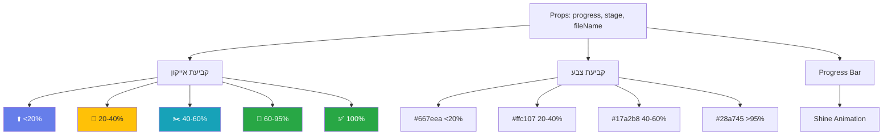
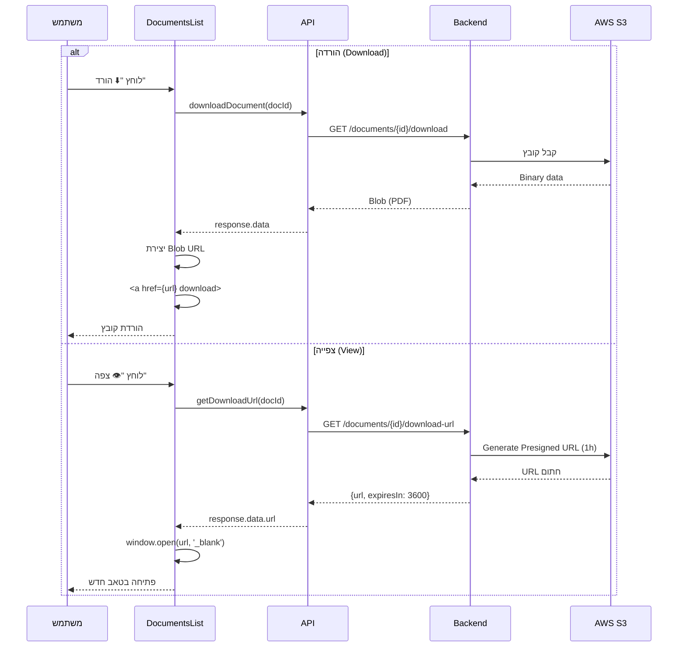
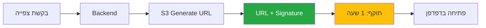
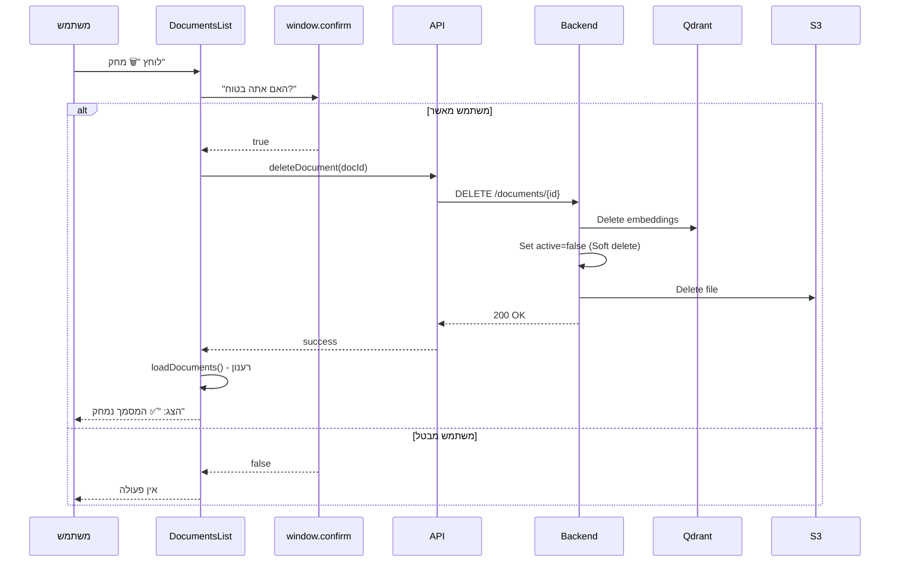
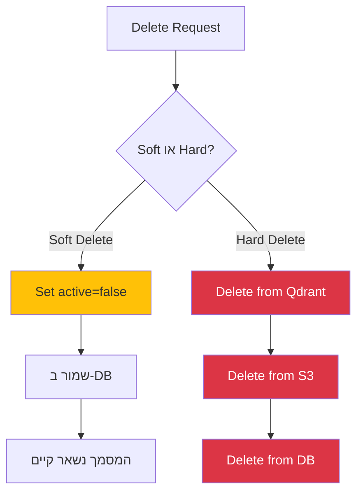

# 📄 Documents Flow - זרימת מסמכים

[← חזרה ל-README הראשי](./README.md)

---

## סקירה

מודול המסמכים כולל:
- 📤 העלאת מסמכים (יחיד/מרובה)
- 📊 מעקב אחר עיבוד (Polling)
- 📥 הורדה וצפייה
- 🗑️ מחיקה

---

## 1️⃣ העלאת מסמכים - Upload Flow

### תרשים זרימה ראשי



### Placeholder System



---

## 2️⃣ מעקב אחר עיבוד - Polling System

### תרשים Polling



### מצבי עיבוד - Processing States



---

## 3️⃣ Progress Bar Component

### תצוגה ויזואלית

```
┌─────────────────────────────────────────────────────────┐
│  📄  contract.pdf                         2.34 MB       │
│                                                          │
│  ██████████████░░░░░░░░░░░░░░░░░ 45%                   │
│                                                          │
│  מחלץ טקסט מהמסמך...                            45%    │
└─────────────────────────────────────────────────────────┘
```

### Logic Flow



---

## 4️⃣ הורדה וצפייה - Download & View

### תרשים זרימה



### Presigned URL Flow



---

## 5️⃣ מחיקת מסמך - Delete Flow

### תרשים זרימה



### Soft Delete vs Hard Delete



---

## 6️⃣ Component Hierarchy

```mermaid
graph TB
    Dashboard[Dashboard.js]
    
    subgraph "Documents Tab"
        DocsList[DocumentsList.js]
        Upload[UploadModal.js]
        Progress[ProgressBar.js]
    end
    
    subgraph "State Management"
        DocsState[documents[]]
        LoadingState[loading]
        PollingRef[pollingIntervalRef]
    end
    
    Dashboard --> DocsList
    DocsList --> Upload
    Upload --> Progress
    
    Dashboard --> DocsState
    Dashboard --> LoadingState
    Dashboard --> PollingRef
    
    DocsState --> DocsList
    LoadingState --> DocsList
    
    style Dashboard fill:#667eea,color:#fff
    style DocsState fill:#28a745,color:#fff
```

---

## 7️⃣ UI States

### Empty State

```
┌─────────────────────────────────────────┐
│                                          │
│              📄                          │
│                                          │
│       אין מסמכים עדיין                  │
│                                          │
│  העלה מסמכים כדי לבנות את מאגר הידע    │
│        של הצ'אט שלך                     │
│                                          │
│    [➕ העלה מסמך חדש]                   │
│                                          │
└─────────────────────────────────────────┘
```

### Processing State

```
┌─────────────────────────────────────────┐
│  מסמכים בעיבוד (2)                      │
│                                          │
│  📄 report.pdf                           │
│  ████████████░░░░░░░ 65%                │
│  יוצר embeddings... 65%                 │
│                                          │
│  📄 contract.pdf                         │
│  █████░░░░░░░░░░░░░ 30%                 │
│  מחלץ טקסט מהמסמך... 30%               │
└─────────────────────────────────────────┘
```

### Completed State

```
┌───────────────────────────────────────────────┐
│  מסמכים מעובדים (5)                          │
│                                                │
│  ┌────────────────────┐  ┌────────────────┐  │
│  │ 📄 report.pdf      │  │ 📄 invoice.pdf │  │
│  │ 2.5 MB             │  │ 1.2 MB         │  │
│  │                    │  │                │  │
│  │ ✓ מעובד            │  │ ✓ מעובד        │  │
│  │                    │  │                │  │
│  │ [👁️] [⬇️] [🗑️]   │  │ [👁️] [⬇️] [🗑️]│  │
│  └────────────────────┘  └────────────────┘  │
└───────────────────────────────────────────────┘
```

---

## 🔄 useEffect Dependencies

```javascript
// Polling Effect
useEffect(() => {
  const hasProcessing = documents.some(
    doc => doc.processingStatus === 'PROCESSING' 
        || doc.processingStatus === 'PENDING'
  );
  
  if (hasProcessing) {
    // Start polling
    intervalRef.current = setInterval(() => {
      loadDocuments(true); // silent
    }, 2000);
  } else {
    // Stop polling
    clearInterval(intervalRef.current);
  }
  
  return () => clearInterval(intervalRef.current);
}, [documents]);
```

---

## 📊 Performance Metrics

| מדד | ערך |
|-----|-----|
| **Polling Interval** | 2 שניות |
| **Max File Size** | 50 MB |
| **Concurrent Uploads** | ללא הגבלה (async) |
| **Processing Time** | 1-3 דקות (ממוצע) |
| **Presigned URL TTL** | 1 שעה |

---

[← חזרה ל-README הראשי](./README.md)
