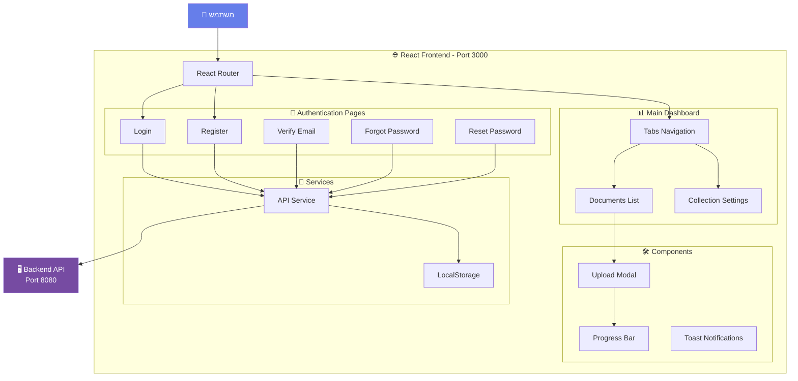
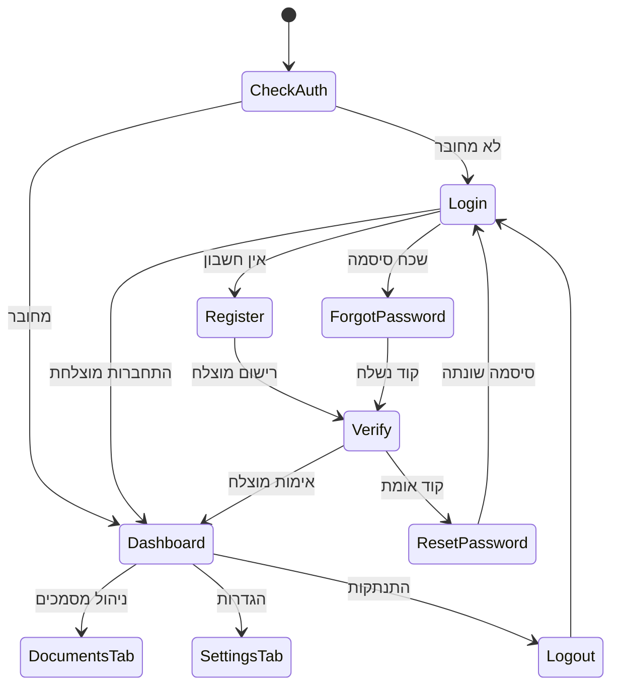
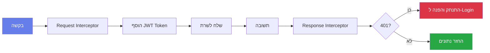
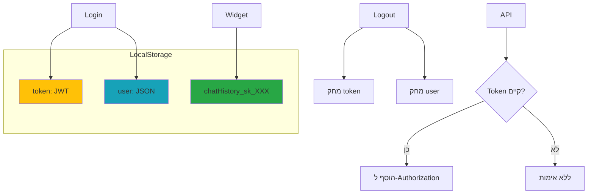
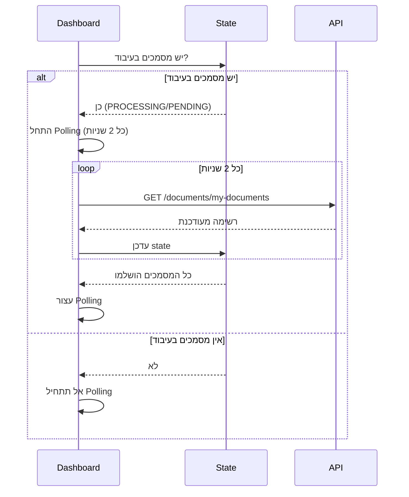

# 🎨 Frontend Documentation - Custom Site Chat

> **React Application for Document-Based Chat Management**

ממשק משתמש מודרני לניהול מסמכים ובניית צ'אט AI מותאם אישית.

---

## 📐 ארכיטקטורה כללית



---

## 🗂 מבנה תיקיות

```
frontend/
├── public/
│   ├── index.html              # HTML ראשי
│   └── chat-widget.js          # Widget לאתרים חיצוניים
│
├── src/
│   ├── components/
│   │   ├── Auth/               # קומפוננטות אימות
│   │   │   ├── Login.js
│   │   │   ├── Register.js
│   │   │   ├── Verify.js
│   │   │   ├── ForgotPassword.js
│   │   │   ├── ResetPassword.js
│   │   │   └── GoogleLoginButton.js
│   │   │
│   │   ├── Dashboard/          # קומפוננטות דשבורד
│   │   │   ├── Dashboard.js
│   │   │   ├── DocumentsList.js
│   │   │   ├── CollectionSettings.js
│   │   │   ├── UploadDocumentModal.js
│   │   │   └── ProgressBar.js
│   │   │
│   │   └── Error/              # דפי שגיאה
│   │       └── ErrorPage.js
│   │
│   ├── services/
│   │   └── api.js              # שירותי API מרכזיים
│   │
│   ├── App.js                  # קומפוננטה ראשית
│   ├── App.css                 # עיצוב גלובלי
│   ├── index.js                # נקודת כניסה
│   └── index.css               # CSS גלובלי
│
├── package.json                # תלויות
├── Dockerfile                  # Docker build
└── nginx-frontend.conf         # הגדרות Nginx
```

---

## 🔄 זרימת ניווט ראשית



---

## 📚 תיעוד מפורט לפי מודולים

### 🔐 [מודול אימות - Authentication](./AUTH_FLOW.md)
מסלולי התחברות, רישום, אימות מייל ושחזור סיסמה.

**תרשימים:**
- זרימת התחברות (Email + Google)
- תהליך רישום ואימות
- שחזור סיסמה (3 שלבים)

[**→ עבור לתיעוד מלא**](./AUTH_FLOW.md)

---

### 📄 [מודול מסמכים - Documents](./DOCUMENTS_FLOW.md)
העלאה, ניהול ומעקב אחר עיבוד מסמכים.

**תרשימים:**
- תהליך העלאת מסמכים
- Polling למעקב אחר עיבוד
- זרימת הורדה ומחיקה

[**→ עבור לתיעוד מלא**](./DOCUMENTS_FLOW.md)

---

### ⚙️ [מודול הגדרות - Collection Settings](./SETTINGS_FLOW.md)
ניהול Secret Key וקוד הטמעה.

**תרשימים:**
- טעינת הגדרות
- חידוש Secret Key
- העתקת קוד הטמעה

[**→ עבור לתיעוד מלא**](./SETTINGS_FLOW.md)

---

### 💬 [Chat Widget - וידג'ט חיצוני](./WIDGET_FLOW.md)
Widget עצמאי להטמעה באתרים חיצוניים.

**תרשימים:**
- אתחול Widget
- זרימת שאלה ותשובה
- ניהול היסטוריה

[**→ עבור לתיעוד מלא**](./WIDGET_FLOW.md)

---

## 🔌 שירותי API

הפרונטנד משתמש בשירות API מרכזי (`/src/services/api.js`) עם:

### Axios Interceptors



### API Endpoints המשמשים בפרונטנד

| קטגוריה | Endpoints | מטרה |
|----------|-----------|------|
| **Auth** | `/auth/login`, `/auth/signup`, `/auth/verify` | אימות |
| **Users** | `/users/me` | פרופיל משתמש |
| **Collection** | `/collection/info`, `/collection/regenerate-key` | הגדרות |
| **Documents** | `/documents/upload`, `/documents/my-documents` | ניהול מסמכים |
| **Query** | `/query/ask` | שאלות (Widget) |

---

## 💾 ניהול State

### LocalStorage



### React State Management

הפרונטנד משתמש ב-**React Hooks** בלבד (ללא Redux):

| Hook | שימוש | דוגמה |
|------|-------|-------|
| `useState` | State מקומי | רשימת מסמכים, טפסים |
| `useEffect` | Side effects | Polling, טעינת נתונים |
| `useRef` | DOM refs | Polling interval |
| `useNavigate` | ניווט | מעבר בין דפים |
| `useSearchParams` | Query params | Email בדף Verify |

---

## 🎨 עיצוב ו-UI

### צבעי ערכת נושא

```css
Primary:   #667eea  /* כחול-סגול */
Secondary: #764ba2  /* סגול כהה */
Success:   #28a745  /* ירוק */
Warning:   #ffc107  /* צהוב */
Error:     #dc3545  /* אדום */
Info:      #17a2b8  /* תכלת */
```

### Gradients

- **Primary Gradient:** `linear-gradient(135deg, #667eea 0%, #764ba2 100%)`
- שימוש: כפתורים, רקעי דפי Login/Register

### Typography

- **Font Family:** `'Segoe UI', Tahoma, Geneva, Verdana, sans-serif`
- **Direction:** RTL (עברית)
- **כפתורים:** 14-16px, font-weight: 600

---

## ⚡ תכונות מיוחדות

### 1. Polling אוטומטי למסמכים בעיבוד



### 2. Google OAuth Integration

- שימוש ב-Google Identity Services API
- כפתור מותאם אישית
- אותו endpoint לרישום והתחברות

### 3. Toast Notifications

מערכת הודעות קופצות:
- ✅ Success (ירוק)
- ❌ Error (אדום)
- ⚠️ Warning (צהוב)

### 4. Progress Tracking

Progress Bar דינמי עם:
- אחוזים (0-100%)
- שלבי עיבוד (7 שלבים)
- אייקונים מתאימים
- אנימציות

---

## 🚀 הרצה מקומית

### Development Mode

```bash
cd frontend
npm install
npm start
```

**פועל על:** `http://localhost:3000`

**Proxy:** מבקשות API מועברות ל-`http://localhost:8080`

### Production Build

```bash
npm run build
```

יוצר תיקיית `build/` עם קבצים סטטיים.

---

## 🐳 Docker Deployment

### Build Arguments

```dockerfile
ARG REACT_APP_GOOGLE_CLIENT_ID
ENV REACT_APP_GOOGLE_CLIENT_ID=$REACT_APP_GOOGLE_CLIENT_ID
```

### Build Command

```bash
docker build \
  --build-arg REACT_APP_GOOGLE_CLIENT_ID=your-client-id \
  -t custom-site-chat-frontend .
```

### Nginx Configuration

- **Port:** 3000
- **SPA Routing:** כל הבקשות חוזרות ל-`index.html`
- **Static Assets Caching:** 1 שנה

---

## 📊 מדדי ביצועים

| מדד | ערך |
|-----|-----|
| **Bundle Size** | ~2.5 MB (dev), ~500 KB (prod) |
| **Initial Load** | <2 שניות |
| **Polling Interval** | 2 שניות |
| **API Timeout** | 30 שניות |

---

## 🔒 אבטחה

### JWT Handling

- שמירה ב-LocalStorage
- הוספה אוטומטית לכל בקשה
- מחיקה בהתנתקות או 401

### XSS Protection

- React עושה escape אוטומטי
- אין שימוש ב-`dangerouslySetInnerHTML`

### CORS

- Backend מאפשר `http://localhost:3000` ב-development
- Production: להגדיר CORS נכון

---

## 🧪 טיפים לפיתוח

### 1. בדיקת Polling

```javascript
// בקונסול:
localStorage.setItem('mockProcessing', 'true');
```

### 2. צפייה ב-LocalStorage

```javascript
console.log({
  token: localStorage.getItem('token'),
  user: JSON.parse(localStorage.getItem('user'))
});
```

### 3. ניקוי Cache

```bash
rm -rf node_modules package-lock.json
npm install
```

---

## 📱 Responsive Design

- **Desktop:** 1200px+
- **Tablet:** 768px - 1199px
- **Mobile:** <768px

**שינויים במובייל:**
- Sidebar הופך לתפריט נפתח
- Grid משתנה לעמודה אחת
- Input area מתקפל

---

## 🆘 בעיות נפוצות

### 1. Google Login לא עובד

**פתרון:** בדוק ש-`REACT_APP_GOOGLE_CLIENT_ID` מוגדר נכון.

```bash
echo $REACT_APP_GOOGLE_CLIENT_ID
```

### 2. Polling לא עובד

**פתרון:** וודא ש-`useEffect` cleanup פועל:

```javascript
return () => {
  if (pollingIntervalRef.current) {
    clearInterval(pollingIntervalRef.current);
  }
};
```

### 3. 401 Unauthorized

**פתרון:** Token פג תוקף - המערכת תפנה אוטומטית ל-Login.

---

## 📞 תמיכה

- 📖 [תיעוד Backend](../README.md)
- 🔐 [זרימות אימות](./AUTH_FLOW.md)
- 📄 [ניהול מסמכים](./DOCUMENTS_FLOW.md)
- ⚙️ [הגדרות](./SETTINGS_FLOW.md)
- 💬 [Widget](./WIDGET_FLOW.md)

---

**Version:** 1.0  
**Last Updated:** 2025-01-15  
**Framework:** React 18.2.0  
**UI Language:** עברית (RTL)
