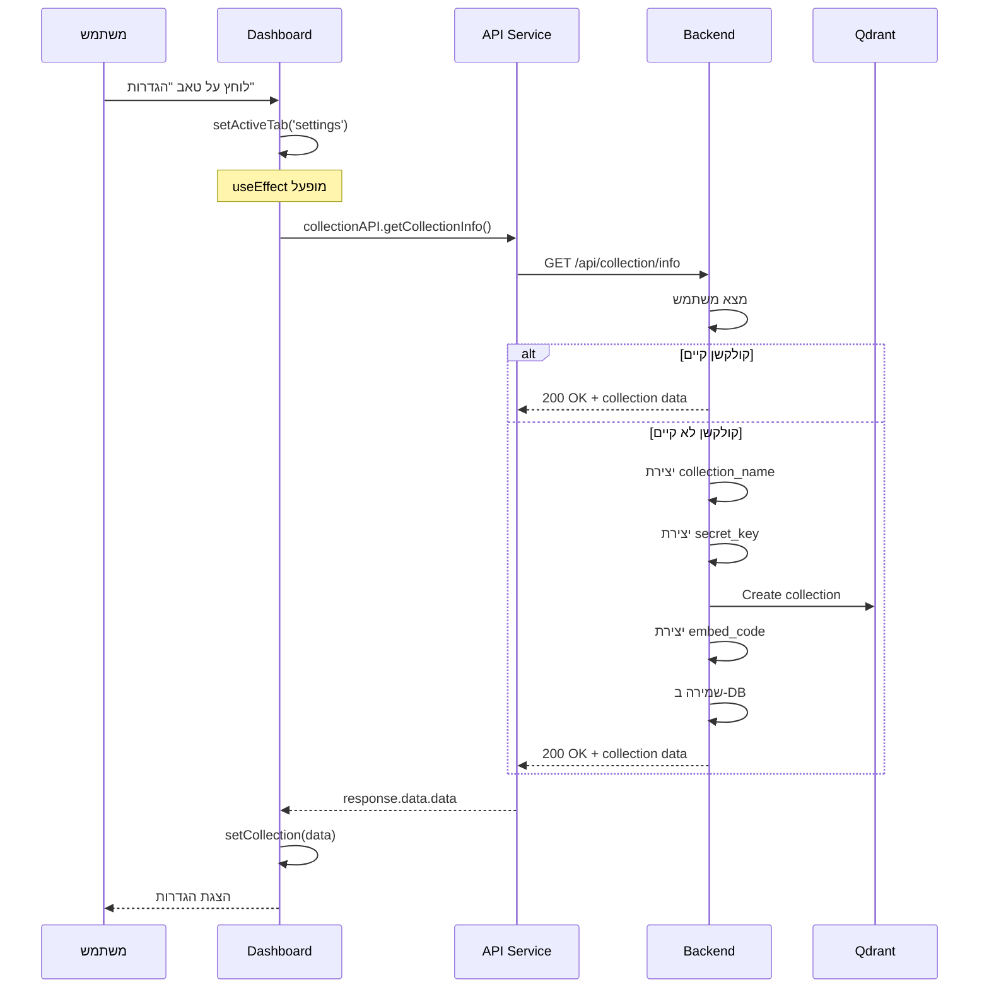
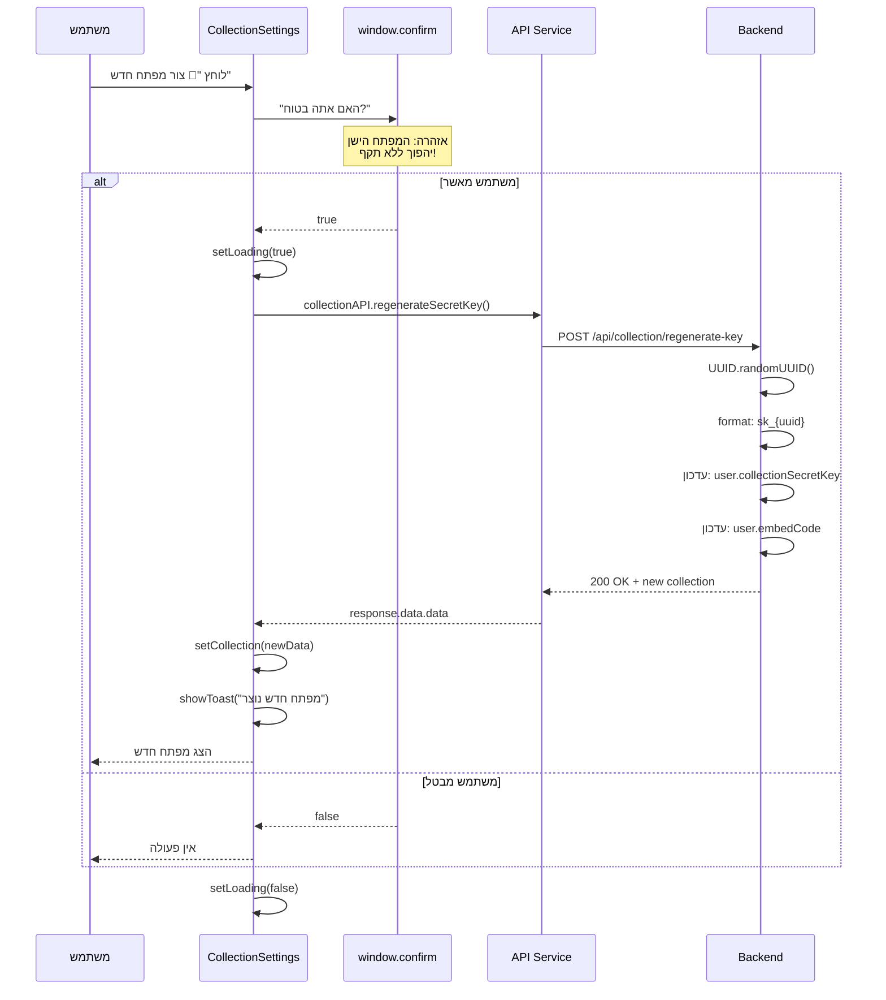
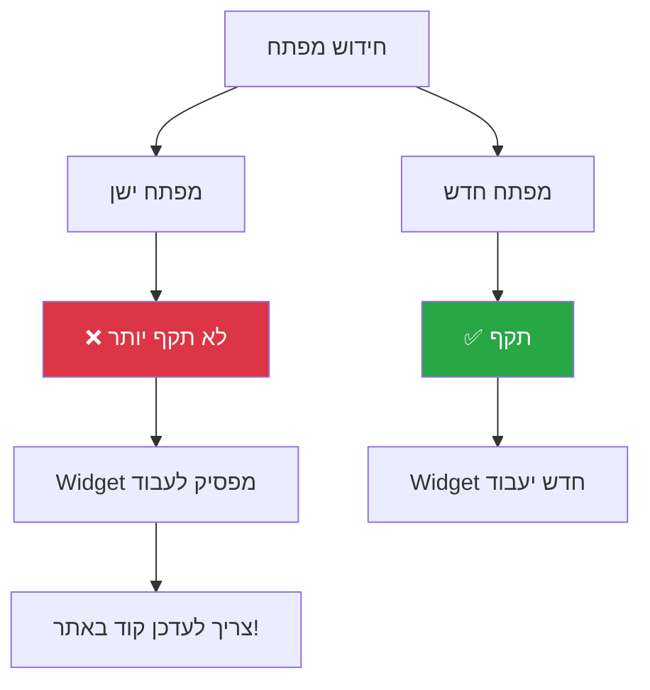
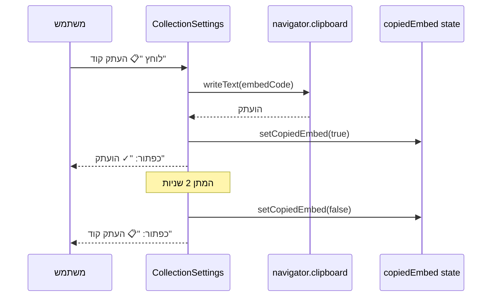
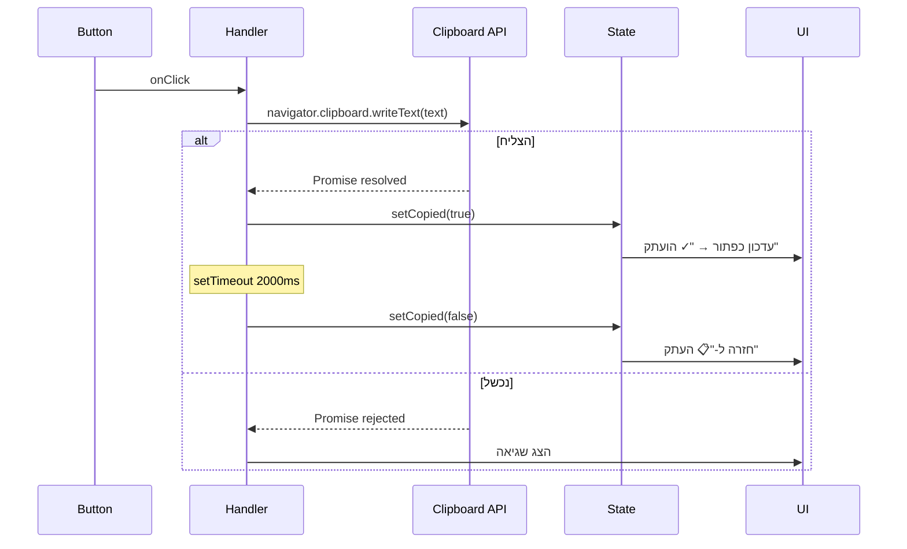
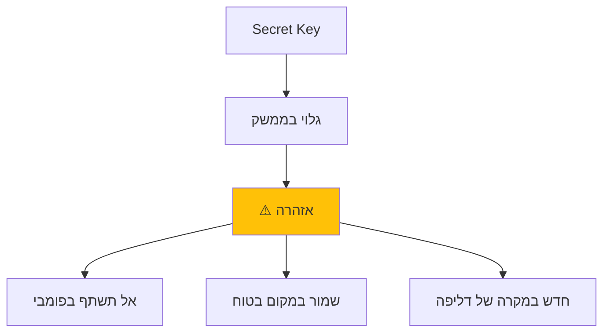

# ⚙️ Settings Flow - זרימת הגדרות

[← חזרה ל-README הראשי](./README.md)

---

## סקירה

טאב ההגדרות מאפשר:
- 📊 צפייה במידע על הקולקשן
- 🔑 ניהול Secret Key
- 📋 קוד הטמעה (Embed Code)

---

## 1️⃣ טעינת הגדרות - Load Settings

### תרשים זרימה



### Collection Name Format

```
user_{userId}_{uuid8}

דוגמה: user_1_a7b3f2e1
```

### Secret Key Format

```
sk_{uuid32}

דוגמה: sk_a1b2c3d4e5f6g7h8i9j0k1l2m3n4o5p6
```

---

## 2️⃣ חידוש Secret Key - Regenerate Key

### תרשים זרימה



### ⚠️ השפעת חידוש מפתח



---

## 3️⃣ העתקת Secret Key

### תרשים זרימה


### UI Feedback

```
לפני: [📋 העתק]
אחרי: [✓ הועתק]  (ירוק)
```

---

## 4️⃣ העתקת קוד הטמעה - Copy Embed Code

### תרשים זרימה



### Embed Code Structure

```html
<!-- Custom Site Chat Widget -->
<script>
  window.CHAT_WIDGET_SECRET_KEY = 'sk_...';
  window.CHAT_WIDGET_API_URL = 'http://localhost:8080';
  
  // התאמה אישית (אופציונלי)
  window.CHAT_WIDGET_TITLE = 'שם החברה';
  window.CHAT_WIDGET_BOT_NAME = 'שם הבוט';
  window.CHAT_WIDGET_BOT_AVATAR = 'URL או null';
  window.CHAT_WIDGET_USER_AVATAR = 'URL או null';
</script>
<script src="http://localhost:3000/chat-widget.js"></script>
<!-- End Chat Widget -->
```

---

## 5️⃣ תצוגת UI - CollectionSettings Component

### Layout Structure

```
┌─────────────────────────────────────────────────────┐
│  ⚙️ הגדרות קולקשן וקוד הטמעה                      │
│                                                      │
│  ┌──────────────────────────────────────────────┐  │
│  │  📊 מידע על הקולקשן                         │  │
│  │                                               │  │
│  │  שם קולקשן:    user_1_a7b3f2e1              │  │
│  │  נוצר בתאריך:  15/01/2025                   │  │
│  └──────────────────────────────────────────────┘  │
│                                                      │
│  ┌──────────────────────────────────────────────┐  │
│  │  🔑 Secret Key                                │  │
│  │                                               │  │
│  │  [sk_a1b2c3d4...]  [📋 העתק]  [🔄 חדש]     │  │
│  │                                               │  │
│  │  ⚠️ אזהרה: יצירת מפתח חדש תבטל הישן        │  │
│  └──────────────────────────────────────────────┘  │
│                                                      │
│  ┌──────────────────────────────────────────────┐  │
│  │  🎨 קוד הטמעה                                │  │
│  │                                               │  │
│  │  ┌────────────────────────────────────────┐  │  │
│  │  │  <!-- Custom Site Chat Widget -->     │  │  │
│  │  │  <script>                              │  │  │
│  │  │    window.CHAT_WIDGET_SECRET_KEY...   │  │  │
│  │  │                       [📋 העתק קוד]   │  │  │
│  │  └────────────────────────────────────────┘  │  │
│  │                                               │  │
│  │  💡 טיפ: הדבק לפני תג </body>               │  │
│  └──────────────────────────────────────────────┘  │
│                                                      │
│  ┌──────────────────────────────────────────────┐  │
│  │  📖 דוגמת שימוש                              │  │
│  │                                               │  │
│  │  <!DOCTYPE html>                              │  │
│  │  <html>...                                    │  │
│  └──────────────────────────────────────────────┘  │
└─────────────────────────────────────────────────────┘
```

---

## 6️⃣ State Management

### Component State

```javascript
const [copiedEmbed, setCopiedEmbed] = useState(false);
const [copiedKey, setCopiedKey] = useState(false);
```

### Props from Dashboard

```javascript
<CollectionSettings
  collection={collection}           // object
  onRegenerateKey={handleRegenerate} // function
  loading={loading}                 // boolean
/>
```

---

## 7️⃣ Error Handling

### תרשים שגיאות

```mermaid
graph TB
    Load[טעינת הגדרות] --> Check{הצליח?}
    
    Check -->|כן| Display[הצג הגדרות]
    Check -->|לא| Error[הצג שגיאה]
    
    Error --> E1[401: לא מחובר]
    Error --> E2[503: Qdrant לא זמין]
    Error --> E3[500: שגיאת שרת]
    
    E1 --> Redirect[הפניה ל-Login]
    E2 --> Toast1[הצג: "שגיאה בשירות"]
    E3 --> Toast2[הצג: "שגיאה כללית"]
    
    style E1 fill:#dc3545,color:#fff
    style E2 fill:#ffc107
    style E3 fill:#dc3545,color:#fff
```

---

## 📊 Copy Mechanism Flow



---

## 🎨 Visual States

### Loading State

```
┌──────────────────────────────┐
│  ⚙️ טוען הגדרות...          │
│                               │
│       [spinner]               │
└──────────────────────────────┘
```

### Success State (After Regenerate)

```
┌──────────────────────────────────────┐
│  ✅ מפתח חדש נוצר בהצלחה!          │
│                                       │
│  🔑 sk_NEW_KEY_x9y8z7w6v5u4         │
└──────────────────────────────────────┘
```

### Copy Feedback

```javascript
// Before
[📋 העתק]

// During (2 seconds)
[✓ הועתק]  // Green background

// After
[📋 העתק]  // Back to default
```

---

## 🔐 Security Considerations

### Secret Key Visibility



### Embed Code Security

- **Embedded ב-HTML:** הקוד נכלל ב-HTML הציבורי
- **Secret Key חשוף:** כל מי שרואה את הקוד יכול לראות את המפתח
- **מגבלות:** Secret Key מאפשר רק שאילת שאלות (Query API)
- **לא מאפשר:** מחיקה, עריכה, או גישה לנתוני משתמש

---

## 📋 Quick Reference

| פעולה | Endpoint | תוצאה |
|-------|----------|-------|
| טעינה | GET /collection/info | קבלת/יצירת collection |
| חידוש | POST /collection/regenerate-key | Secret Key חדש |
| קוד | GET /collection/embed-code | קוד להטמעה |

---

[← חזרה ל-README הראשי](./README.md)
