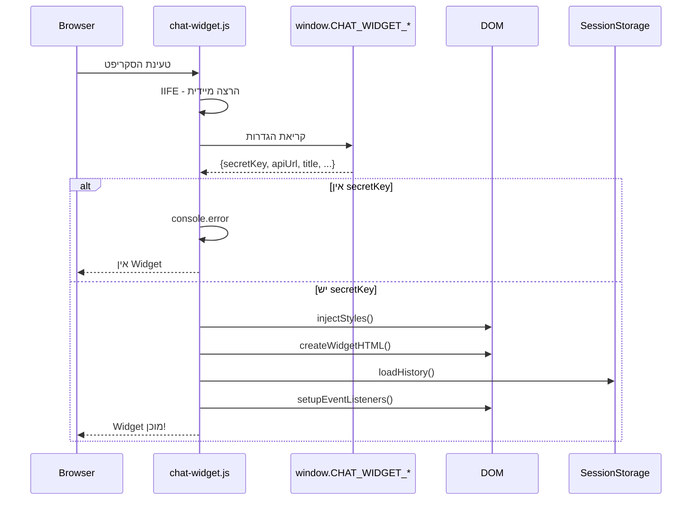
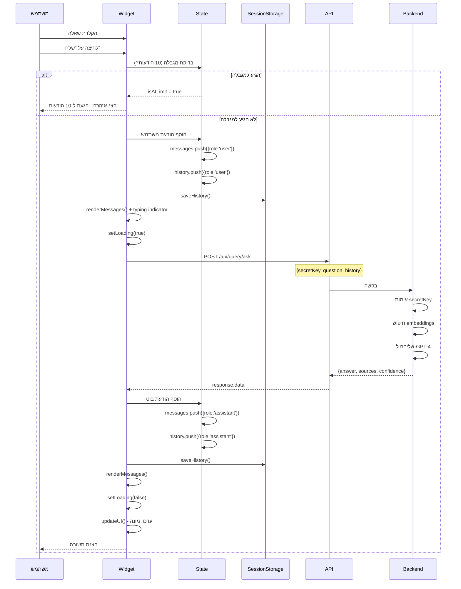
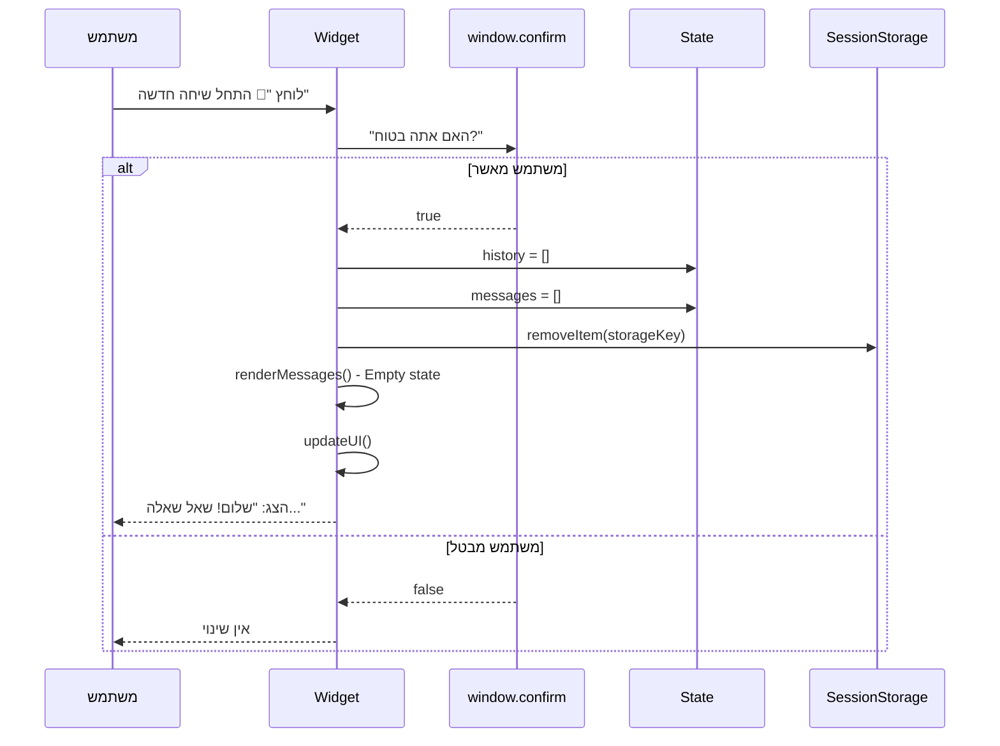

# 💬 Chat Widget Flow - זרימת Widget

[← חזרה ל-README הראשי](./README.md)

---

## סקירה

ה-Widget הוא **קובץ JavaScript עצמאי** שניתן להטמיע באתרים חיצוניים. הוא מאפשר למשתמשים לשאול שאלות על המסמכים.

**קובץ:** `/public/chat-widget.js`

---

## 1️⃣ אתחול Widget - Initialization

### תרשים זרימה



### הגדרות Widget

```javascript
window.CHAT_WIDGET_SECRET_KEY = 'sk_...';  // חובה!
window.CHAT_WIDGET_API_URL = 'http://localhost:8080';
window.CHAT_WIDGET_TITLE = 'צ\'אט עם המסמכים';  // אופציונלי
window.CHAT_WIDGET_BOT_NAME = 'AI';
window.CHAT_WIDGET_BOT_AVATAR = null;
window.CHAT_WIDGET_USER_AVATAR = null;
window.CHAT_WIDGET_MAX_HISTORY = 10;  // מקסימום היסטוריה
```

---

## 2️⃣ UI Components

### Widget Structure

```
                  [💬] ← Toggle Button
                   │
    ┌──────────────┴──────────────┐
    │  ┌────────────────────────┐ │
    │  │ Header                 │ │
    │  │ [🔄] Title     [✕]    │ │
    │  ├────────────────────────┤ │
    │  │ ⚠️ Limit Warning       │ │
    │  ├────────────────────────┤ │
    │  │ Messages Container     │ │
    │  │                        │ │
    │  │  👤 User: שאלה?       │ │
    │  │  🤖 Bot: תשובה...     │ │
    │  │                        │ │
    │  ├────────────────────────┤ │
    │  │ Input Area             │ │
    │  │ [____________]  [שלח] │ │
    │  └────────────────────────┘ │
    └──────────────────────────────┘
```

### CSS Injection

Widget מזריק **inline CSS** דינמית:
- Gradient ראשי: `#667eea → #764ba2`
- RTL Support
- Animations (slideUp, typing)
- Mobile Responsive

---

## 3️⃣ שאילת שאלה - Ask Question Flow

### תרשים זרימה מלא



---

## 4️⃣ ניהול היסטוריה - History Management

### Structure

```javascript
{
  history: [
    { role: 'user', content: 'שאלה 1' },
    { role: 'assistant', content: 'תשובה 1' },
    { role: 'user', content: 'שאלה 2' },
    { role: 'assistant', content: 'תשובה 2' }
  ],
  messages: [...] // אותו הדבר להצגה
}
```

### Storage Key

```javascript
const storageKey = 'chatHistory_' + config.secretKey;
```

### Limit Management

```mermaid
graph TB
    Message[הודעה חדשה] --> Check{history.length >= 10?}
    
    Check -->|כן| Disable[השבת input]
    Disable --> Warning[הצג אזהרה]
    Warning --> ShowReset[הצג כפתור "התחל חדש"]
    
    Check -->|לא| Allow[אפשר שליחה]
    Allow --> Add[הוסף להיסטוריה]
    Add --> Update[עדכן UI]
    
    ShowReset --> Reset{לחץ איפוס?}
    Reset -->|כן| Clear[נקה היסטוריה]
    Clear --> Enable[אפשר input]
    
    style Disable fill:#dc3545,color:#fff
    style Enable fill:#28a745,color:#fff
```

---

## 5️⃣ איפוס שיחה - Reset Chat

### תרשים זרימה



---

## 6️⃣ State Management

### Widget State Object

```javascript
const state = {
  messages: [],           // הודעות להצגה
  history: [],           // היסטוריה ל-API
  isOpen: false,         // האם Widget פתוח
  isLoading: false,      // האם ממתין לתשובה
  sessionId: 'session_...',  // מזהה ייחודי
  maxHistoryMessages: 10 // מגבלה
};
```

### UI Elements

```javascript
const elements = {
  toggleButton: document.getElementById('chat-widget-toggle'),
  resetButton: document.getElementById('reset-button'),
  widgetWindow: document.getElementById('chat-widget-window'),
  messagesContainer: document.getElementById('chat-widget-messages'),
  inputField: document.getElementById('chat-widget-input'),
  sendButton: document.getElementById('chat-widget-send'),
  messageCounter: document.getElementById('message-counter'),
  limitWarning: document.getElementById('limit-warning')
};
```

---

## 7️⃣ תכונות מיוחדות

### 1. Language Detection

```javascript
function detectLanguage(text) {
  let hebrewChars = 0;
  let totalChars = 0;
  
  for (let char of text) {
    if (/\p{L}/u.test(char)) {
      totalChars++;
      if (char >= '\u0590' && char <= '\u05FF') {
        hebrewChars++;
      }
    }
  }
  
  return (hebrewChars / totalChars) > 0.3 ? 'he' : 'en';
}
```

**תוצאה:**
- אם >30% אותיות עבריות → `direction: rtl`
- אחרת → `direction: ltr`

### 2. Typing Indicator

```
   ●  ●  ●   ← אנימציה קופצת
```

### 3. Avatar System

```javascript
// User Avatar
if (config.userAvatar) {
  
} else {
  "אני"  // Default
}

// Bot Avatar
if (config.botAvatar) {
  
} else {
  config.botName.charAt(0)  // First letter
}
```

---

## 8️⃣ API Request Structure

### Request Body

```json
{
  "secretKey": "sk_a1b2c3d4e5f6g7h8i9j0k1l2m3n4o5p6",
  "question": "מה תנאי התשלום?",
  "history": [
    {
      "role": "user",
      "content": "ספר לי על החוזה"
    },
    {
      "role": "assistant",
      "content": "זהו חוזה שירות בין חברה A לחברה B..."
    }
  ]
}
```

### Response Structure

```json
{
  "success": true,
  "data": {
    "answer": "תנאי התשלום הם Net 30...",
    "sources": [
      {
        "documentName": "contract.pdf",
        "excerpt": "תנאי תשלום: Net 30 ימים...",
        "relevanceScore": 0.89,
        "isPrimary": true
      }
    ],
    "responseTimeMs": 2340,
    "confidence": 0.805,
    "tokensUsed": 487
  }
}
```

---

## 9️⃣ Error Handling

### תרשים שגיאות

```mermaid
graph TB
    Request[שליחת שאלה] --> Try{try-catch}
    
    Try -->|Success| Check{response.success?}
    Try -->|Error| Network[Network Error]
    
    Check -->|true| Display[הצג תשובה]
    Check -->|false| APIError[API Error]
    
    Network --> Show1[הצג: "שגיאה בחיבור"]
    APIError --> Show2[הצג: "לא מצאתי תשובה"]
    
    style Network fill:#dc3545,color:#fff
    style APIError fill:#ffc107
```

### Error Messages

| סוג שגיאה | הודעה |
|-----------|-------|
| Network | "אירעה שגיאה. אנא נסה שוב מאוחר יותר." |
| No Answer | "מצטער, לא הצלחתי למצוא תשובה. אנא נסה שוב." |
| Invalid Key | "מפתח API לא תקין" |

---

## 🔟 Lifecycle Diagram

```mermaid
stateDiagram-v2
    [*] --> ScriptLoad: טעינת סקריפט
    ScriptLoad --> Init: IIFE מופעל
    
    Init --> CheckKey{secretKey?}
    CheckKey -->|לא| Error: console.error
    Error --> [*]
    
    CheckKey -->|כן| InjectCSS
    InjectCSS --> CreateHTML
    CreateHTML --> LoadHistory
    LoadHistory --> SetupListeners
    SetupListeners --> Ready: Widget מוכן
    
    Ready --> Closed: מצב ראשוני
    Closed --> Open: לחיצה על 💬
    Open --> Closed: לחיצה על ✕
    
    Open --> WaitInput: ממתין לשאלה
    WaitInput --> Sending: שליחת שאלה
    Sending --> Loading: ממתין לתשובה
    Loading --> Display: הצגת תשובה
    Display --> WaitInput
    
    WaitInput --> Reset: איפוס שיחה
    Reset --> EmptyState
    EmptyState --> WaitInput
```

---

## 🎨 Visual States

### Closed State
```
[💬]  ← בועה בפינת המסך
```

### Open State - Empty
```
┌────────────────────────────┐
│ צ'אט עם המסמכים       [✕] │
├────────────────────────────┤
│                             │
│          💬                 │
│        שלום!                │
│   שאל שאלה על המסמכים      │
│                             │
├────────────────────────────┤
│ [_______________]  [שלח]   │
└────────────────────────────┘
```

### Open State - With Messages
```
┌────────────────────────────┐
│ [🔄] צ'אט...          [✕] │
│  0/10 הודעות               │
├────────────────────────────┤
│  👤  מה תנאי התשלום?      │
│                             │
│  🤖  תנאי התשלום הם...    │
│                             │
├────────────────────────────┤
│ [_______________]  [שלח]   │
└────────────────────────────┘
```

### Loading State
```
┌────────────────────────────┐
│  🤖  ●  ●  ●              │  ← אנימציה
└────────────────────────────┘
```

### Limit Reached
```
┌────────────────────────────┐
│ ⚠️ הגעת למגבלת 10 הודעות  │
│    לחץ על "התחל חדש"       │
├────────────────────────────┤
│ [disabled input]     [✕]   │
└────────────────────────────┘
```

---

## 📊 Performance

| מדד | ערך |
|-----|-----|
| **Script Size** | ~15 KB (minified) |
| **Initial Load** | <500ms |
| **Response Time** | 2-4 שניות (כולל GPT-4) |
| **Max History** | 10 הודעות |

---

## 🔒 Security

### 1. Secret Key Exposure

✅ **מותר:** Secret Key גלוי ב-HTML  
⚠️ **מגבלה:** מאפשר רק Query API  
❌ **לא מאפשר:** מחיקה, עריכה, גישה למשתמש

### 2. CORS

Backend צריך לאפשר:
```javascript
allowedOrigins: ['*']  // או דומיין ספציפי
```

### 3. Rate Limiting

- Backend יכול להגביל לפי `secretKey`
- כרגע: ללא הגבלה

---

## 🆘 Troubleshooting

| בעיה | פתרון |
|------|-------|
| Widget לא מופיע | בדוק `secretKey` ב-console |
| שגיאת CORS | הגדר CORS ב-Backend |
| לא מקבל תשובות | בדוק `API_URL` נכון |
| היסטוריה לא נשמרת | בדוק `sessionStorage` enabled |

---

[← חזרה ל-README הראשי](./README.md)
