# Authentication Flow

> Complete authentication system with email/password and Google OAuth integration

---

## 📑 Table of Contents

1. [Overview](#overview)
2. [Email/Password Login](#emailpassword-login)
3. [Google OAuth Login](#google-oauth-login)
4. [Email/Password Registration](#emailpassword-registration)
5. [Google OAuth Registration](#google-oauth-registration)
6. [Email Verification](#email-verification)
7. [Forgot Password](#forgot-password)
8. [Reset Password](#reset-password)
9. [Component Relationships](#component-relationships)
10. [JWT Token Management](#jwt-token-management)
11. [Error Handling](#error-handling)

---

## Overview

The authentication system supports two methods:
- **Email/Password**: Traditional registration with email verification
- **Google OAuth**: One-click sign-up with auto-verification

**Key Features:**
- JWT-based authentication
- 6-digit verification codes (15-minute expiry)
- Auto-logout on token expiration
- Axios interceptors for token injection
- LocalStorage for session persistence

---

## Email/Password Login

### Flow Diagram


### Request/Response

**Request:**
```http
POST /auth/login
Content-Type: application/json

{
  "email": "user@example.com",
  "password": "SecurePass123!"
}
```

**Response (Success):**
```json
{
  "token": "eyJhbGciOiJIUzI1NiIsInR5cCI6IkpXVCJ9...",
  "user": {
    "id": "123",
    "email": "user@example.com",
    "name": "John Doe"
  }
}
```

**Response (Error):**
```json
{
  "error": "Invalid email or password"
}
```

### UI States

```
┌─────────────────────────┐
│   Login Form (Empty)    │
│  ┌───────────────────┐  │
│  │ Email             │  │
│  └───────────────────┘  │
│  ┌───────────────────┐  │
│  │ Password          │  │
│  └───────────────────┘  │
│  [Login] [Register]     │
│  ─── OR ───             │
│  [🔵 Login with Google] │
└─────────────────────────┘

┌─────────────────────────┐
│   Login Form (Loading)  │
│  ⏳ Logging in...        │
│  [Disabled inputs]      │
└─────────────────────────┘

┌─────────────────────────┐
│   Login Form (Error)    │
│  ❌ Invalid credentials  │
│  [Active inputs]        │
└─────────────────────────┘
```

---

## Google OAuth Login

### Flow Diagram


### Google OAuth Configuration

**Google Identity Services API:**
```javascript
window.google.accounts.id.initialize({
  client_id: process.env.REACT_APP_GOOGLE_CLIENT_ID,
  callback: handleGoogleLogin
});
```

**Request:**
```http
POST /auth/google-login
Content-Type: application/json

{
  "credential": "eyJhbGciOiJSUzI1NiIsImtpZCI6IjM..."
}
```

---

## Email/Password Registration

### Flow Diagram


### Password Validation

**Requirements:**
- Minimum 8 characters
- At least one uppercase letter
- At least one lowercase letter
- At least one number
- At least one special character

**Validation Logic:**

```mermaid
flowchart TD
    A[Password Input] --> B{Length >= 8?}
    B -->|No| E[❌ Error]
    B -->|Yes| C{Has uppercase?}
    C -->|No| E
    C -->|Yes| D{Has lowercase?}
    D -->|No| E
    D -->|Yes| F{Has number?}
    F -->|No| E
    F -->|Yes| G{Has special char?}
    G -->|No| E
    G -->|Yes| H[✅ Valid]
```


### Request/Response

**Request:**
```http
POST /auth/register
Content-Type: application/json

{
  "name": "John Doe",
  "email": "john@example.com",
  "password": "SecurePass123!"
}
```

**Response (Success):**
```json
{
  "message": "User registered successfully. Please check your email for verification code.",
  "email": "john@example.com"
}
```

---

## Google OAuth Registration

### Flow Diagram



```mermaid
sequenceDiagram
    participant User
    participant RegisterPage
    participant GoogleOAuth
    participant API
    participant LocalStorage
    participant Dashboard

    User->>RegisterPage: Click "Register with Google"
    RegisterPage->>GoogleOAuth: Open Google popup
    GoogleOAuth-->>User: Select Google account
    User->>GoogleOAuth: Authorize app
    GoogleOAuth-->>RegisterPage: Return credential token
    RegisterPage->>API: POST /auth/google-register {credential}
    
    alt Success (New user)
        API-->>RegisterPage: 201 Created + JWT token
        RegisterPage->>LocalStorage: Store token
        RegisterPage->>Dashboard: Redirect to /dashboard
        Note over RegisterPage: Email auto-verified ✅
    else Error (Email exists)
        API-->>RegisterPage: 409 Conflict
        RegisterPage-->>User: "Email already registered"
    end
```

### Key Difference: Email vs Google OAuth

| Feature | Email/Password | Google OAuth |
|---------|---------------|--------------|
| Email Verification | ✉️ Required (6-digit code) | ✅ Auto-verified |
| Password | 🔒 User creates | ❌ Not needed |
| Registration Time | 2-3 minutes | 10 seconds |
| Security | Medium (depends on password) | High (Google auth) |

---

## Email Verification

### Flow Diagram


### Verification Code Format

**Format:** 6 digits (e.g., `123456`)  
**Expiry:** 15 minutes  
**Storage:** Backend database with timestamp

### UI States

```
┌─────────────────────────────┐
│   Email Verification        │
│  Check your email for code  │
│  ┌─┬─┬─┬─┬─┬─┐              │
│  │1│2│3│4│5│6│              │
│  └─┴─┴─┴─┴─┴─┘              │
│  [Verify]                   │
│  Didn't receive? [Resend]   │
└─────────────────────────────┘
```

---

## Forgot Password

### Flow Diagram


### Security Note

Even if the email doesn't exist, the app shows the same success message to prevent email enumeration attacks.

---

## Reset Password

### Flow Diagram


### Reset Password States


---

## Component Relationships


---

## JWT Token Management

### Token Flow


### Axios Interceptor Code

```javascript
// Request interceptor - Add token to headers
api.interceptors.request.use(
  (config) => {
    const token = localStorage.getItem('token');
    if (token) {
      config.headers.Authorization = `Bearer ${token}`;
    }
    return config;
  },
  (error) => Promise.reject(error)
);

// Response interceptor - Handle 401
api.interceptors.response.use(
  (response) => response,
  (error) => {
    if (error.response?.status === 401) {
      localStorage.removeItem('token');
      window.location.href = '/login';
    }
    return Promise.reject(error);
  }
);
```

---

## Error Handling

### Error Message Mapping

| HTTP Status | Error Type | User Message |
|-------------|-----------|--------------|
| 400 | Bad Request | "Invalid input. Please check your data." |
| 401 | Unauthorized | "Invalid email or password." |
| 403 | Forbidden | "Please verify your email first." |
| 404 | Not Found | "Account not found." |
| 409 | Conflict | "Email already registered." |
| 410 | Gone | "Verification code expired." |
| 500 | Server Error | "Something went wrong. Try again later." |

### Error State Diagram

```mermaid
flowchart TD
    A[API Request] --> B{Response}
    B -->|200-299| C[✅ Success]
    B -->|400| D[❌ Validation Error]
    B -->|401| E[❌ Unauthorized]
    B -->|403| F[❌ Forbidden]
    B -->|404| G[❌ Not Found]
    B -->|409| H[❌ Conflict]
    B -->|410| I[❌ Expired]
    B -->|500+| J[❌ Server Error]
    
    D --> K[Show field errors]
    E --> L[Redirect to login]
    F --> M[Show verification message]
    G --> N[Show not found message]
    H --> O[Show conflict message]
    I --> P[Show resend option]
    J --> Q[Show retry button]
```



---

## Summary

✅ **Authentication Methods:** Email/Password + Google OAuth  
✅ **Verification:** 6-digit codes with 15-minute expiry  
✅ **Security:** JWT tokens, password validation, auto-logout  
✅ **User Experience:** Clear error messages, loading states  
✅ **Token Management:** Axios interceptors for seamless API calls

---

[← Back to Main README](../README.md)
