# Document Management Flow

> Complete document lifecycle: Upload → Process → Download → Delete

---

## 📑 Table of Contents

1. [Overview](#overview)
2. [Upload Flow](#upload-flow)
3. [Placeholder System](#placeholder-system)
4. [Polling System](#polling-system)
5. [Processing States](#processing-states)
6. [Progress Bar](#progress-bar)
7. [Download & View](#download--view)
8. [Delete Flow](#delete-flow)
9. [UI States](#ui-states)

---

## Overview

The document management system handles:
- **Multi-file uploads** (up to 50 MB per file)
- **Real-time processing** with 2-second polling
- **Progress tracking** across 7 processing stages
- **Download/View** with presigned URLs
- **Soft delete** for recovery option

**Processing Pipeline:**
```
Upload → Pending → Uploading → Extracting → Chunking → 
Embeddings → Storing → Completed
```

---

## Upload Flow

### Single File Upload


### Multiple Files Upload


### Request Format

**Request:**
```http
POST /documents/upload
Content-Type: multipart/form-data

FormData:
- file: [Binary file data]
```

**Response:**
```json
{
  "id": "doc_abc123",
  "filename": "report.pdf",
  "size": 2048576,
  "status": "PENDING",
  "progress": 0,
  "created_at": "2024-12-01T10:00:00Z"
}
```

---

## Placeholder System

### How It Works

1. **User selects file** → Frontend creates temporary placeholder
2. **Placeholder ID:** `temp_${Date.now()}_${Math.random()}`
3. **Placeholder state:** `{ id, filename, status: 'PENDING', progress: 0 }`
4. **After upload:** Replace `temp_xxx` with real document ID from API

### Placeholder Flow


### Code Example (useEffect Dependencies)

```javascript
useEffect(() => {
  // Fetch documents on mount
  fetchDocuments();
}, []); // Empty dependency array = run once

useEffect(() => {
  // Start polling for processing documents
  const processingDocs = documents.filter(
    doc => doc.status !== 'COMPLETED' && doc.status !== 'FAILED'
  );
  
  if (processingDocs.length > 0) {
    startPolling();
  } else {
    stopPolling();
  }
  
  return () => stopPolling(); // Cleanup
}, [documents]); // Re-run when documents change
```

---

## Polling System

### Mechanism

**Interval:** Every 2 seconds  
**Condition:** While at least one document is processing  
**Stop:** When all documents are `COMPLETED` or `FAILED`

### Polling Flow


### Polling Logic


**Processing Statuses:**
- `PENDING`
- `UPLOADING`
- `EXTRACTING`
- `CHUNKING`
- `EMBEDDINGS`
- `STORING`

**Final Statuses:**
- `COMPLETED` ✅
- `FAILED` ❌

---

## Processing States

### State Progression


### State Details

| Stage | Progress Range | Description | Typical Duration |
|-------|---------------|-------------|------------------|
| **PENDING** | 0% | Waiting in queue | < 1 second |
| **UPLOADING** | 10-20% | Uploading to server | 5-30 seconds |
| **EXTRACTING** | 30-45% | Extracting text from PDF/DOCX | 10-40 seconds |
| **CHUNKING** | 50-60% | Splitting into chunks | 5-15 seconds |
| **EMBEDDINGS** | 65-95% | Generating embeddings | 30-90 seconds |
| **STORING** | 65-95% | Saving to vector DB | 10-20 seconds |
| **COMPLETED** | 100% | Ready for querying | - |
| **FAILED** | - | Error occurred | - |

### Total Processing Time

- **Small file (< 5 MB):** 1-2 minutes
- **Medium file (5-20 MB):** 2-4 minutes
- **Large file (20-50 MB):** 4-6 minutes

---

## Progress Bar

### Visual Representation

```
Progress: 0% (PENDING)
[░░░░░░░░░░░░░░░░░░░░] ⏳ Pending

Progress: 15% (UPLOADING)
[███░░░░░░░░░░░░░░░░░] ⬆️ Uploading

Progress: 40% (EXTRACTING)
[████████░░░░░░░░░░░░] 📄 Extracting

Progress: 55% (CHUNKING)
[███████████░░░░░░░░░] ✂️ Chunking

Progress: 80% (EMBEDDINGS)
[████████████████░░░░] 🧠 Embeddings

Progress: 90% (STORING)
[██████████████████░░] 💾 Storing

Progress: 100% (COMPLETED)
[████████████████████] ✅ Completed
```

### Progress Bar Logic

```mermaid
flowchart TD
    A[Document Status] --> B{Status?}
    
    B -->|PENDING| C[Progress: 0%<br/>Icon: ⏳<br/>Color: Gray]
    B -->|UPLOADING| D[Progress: 10-20%<br/>Icon: ⬆️<br/>Color: Blue]
    B -->|EXTRACTING| E[Progress: 30-45%<br/>Icon: 📄<br/>Color: Purple]
    B -->|CHUNKING| F[Progress: 50-60%<br/>Icon: ✂️<br/>Color: Orange]
    B -->|EMBEDDINGS| G[Progress: 65-95%<br/>Icon: 🧠<br/>Color: Teal]
    B -->|STORING| H[Progress: 65-95%<br/>Icon: 💾<br/>Color: Indigo]
    B -->|COMPLETED| I[Progress: 100%<br/>Icon: ✅<br/>Color: Green]
    B -->|FAILED| J[Progress: -<br/>Icon: ❌<br/>Color: Red]
```



### Progress Bar Component

**Props:**
- `progress`: Number (0-100)
- `status`: String (current stage)
- `filename`: String

**Render Logic:**
1. Calculate fill width: `${progress}%`
2. Get icon based on status
3. Get color based on status
4. Display status text

---

## Download & View

### Download Flow (Blob)


### View Flow (Presigned URL)


### Presigned URL Details

**Expiry Time:** 1 hour  
**Purpose:** Secure file access without exposing S3 credentials  
**Format:**
```
https://bucket.s3.region.amazonaws.com/path/to/file?
  X-Amz-Algorithm=AWS4-HMAC-SHA256&
  X-Amz-Credential=...&
  X-Amz-Date=20241201T100000Z&
  X-Amz-Expires=3600&
  X-Amz-Signature=...
```

### Download vs View

| Feature | Download | View |
|---------|----------|------|
| Method | Blob response | Presigned URL |
| Opens | Save dialog | New browser tab |
| Expiry | Immediate | 1 hour |
| Use Case | Save to disk | Preview in browser |

---

## Delete Flow

### Soft Delete


### Delete Confirmation Dialog

```
┌─────────────────────────────────┐
│  ⚠️  Delete Document?            │
│                                 │
│  Are you sure you want to       │
│  delete "report.pdf"?           │
│                                 │
│  This action cannot be undone.  │
│                                 │
│  [Cancel]  [Yes, Delete]        │
└─────────────────────────────────┘
```

### Soft Delete vs Hard Delete


**Current Implementation:** Soft delete only  
**Benefit:** Can implement "Restore" feature later  
**Database:** `active` column (boolean)

---

## UI States

### Empty State

```
┌─────────────────────────────────────┐
│                                     │
│           📄                         │
│     No documents yet                │
│                                     │
│  Upload your first document to      │
│  get started with AI chat.          │
│                                     │
│       [Upload Document]             │
│                                     │
└─────────────────────────────────────┘
```

### Processing State

```
┌─────────────────────────────────────┐
│  📄 Documents (3)                    │
│                                     │
│  ┌────────────────────────────┐    │
│  │ 📄 report.pdf (2.4 MB)      │    │
│  │ [████████████████████]     │    │
│  │ ✅ Completed 100%           │    │
│  │ [View] [Download] [Delete] │    │
│  └────────────────────────────┘    │
│                                     │
│  ┌────────────────────────────┐    │
│  │ 📄 invoice.pdf (1.8 MB)     │    │
│  │ [████████░░░░░░░░░░░░]     │    │
│  │ 🧠 Generating embeddings 75%│    │
│  └────────────────────────────┘    │
│                                     │
│  ┌────────────────────────────┐    │
│  │ 📄 contract.docx (3.1 MB)   │    │
│  │ [███░░░░░░░░░░░░░░░░░]     │    │
│  │ ⬆️ Uploading 15%            │    │
│  └────────────────────────────┘    │
│                                     │
│       [Upload More]                 │
└─────────────────────────────────────┘
```

### Completed State

```
┌─────────────────────────────────────┐
│  📄 Documents (5)        🔍 Search   │
│                                     │
│  ┌────────────────────────────┐    │
│  │ 📄 report.pdf         ✅    │    │
│  │ 2.4 MB • Dec 1, 2024       │    │
│  │ [View] [Download] [Delete] │    │
│  └────────────────────────────┘    │
│                                     │
│  ┌────────────────────────────┐    │
│  │ 📄 invoice.pdf        ✅    │    │
│  │ 1.8 MB • Dec 1, 2024       │    │
│  │ [View] [Download] [Delete] │    │
│  └────────────────────────────┘    │
│                                     │
│  ... (3 more)                       │
│                                     │
│       [Upload More]                 │
└─────────────────────────────────────┘
```

---

## Performance Metrics

| Metric | Value |
|--------|-------|
| **Max File Size** | 50 MB |
| **Polling Interval** | 2 seconds |
| **Presigned URL TTL** | 1 hour |
| **Avg Processing Time** | 1-3 minutes |
| **Concurrent Uploads** | 1 (sequential) |
| **Supported Formats** | PDF, DOCX, TXT |

---

## Summary

✅ **Upload:** Multi-file support with placeholders  
✅ **Processing:** 7-stage pipeline with real-time progress  
✅ **Polling:** 2-second interval for status updates  
✅ **Download:** Blob response for immediate download  
✅ **View:** Presigned URLs for browser preview  
✅ **Delete:** Soft delete for recovery option

---

[← Back to Main README](../README.md)
