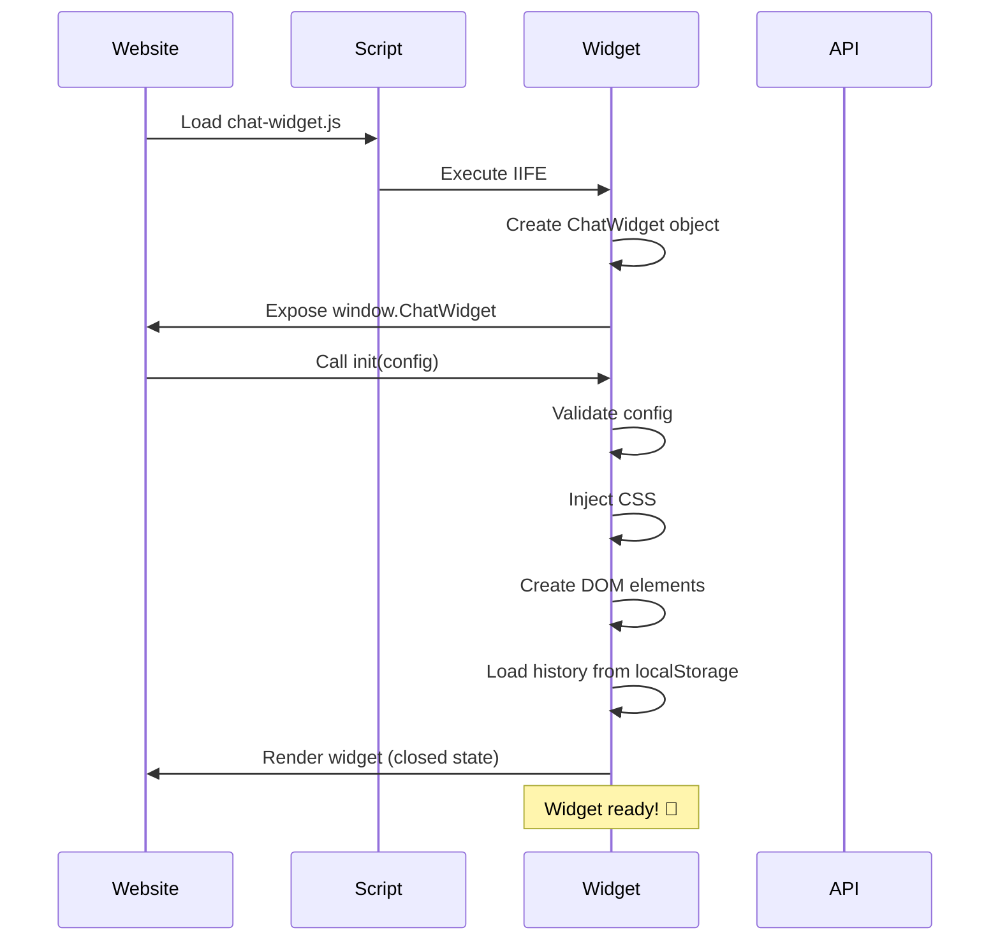
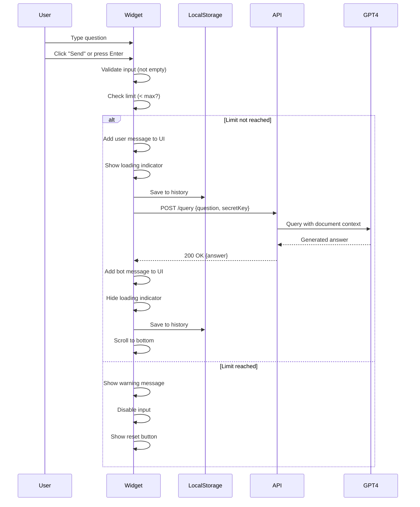
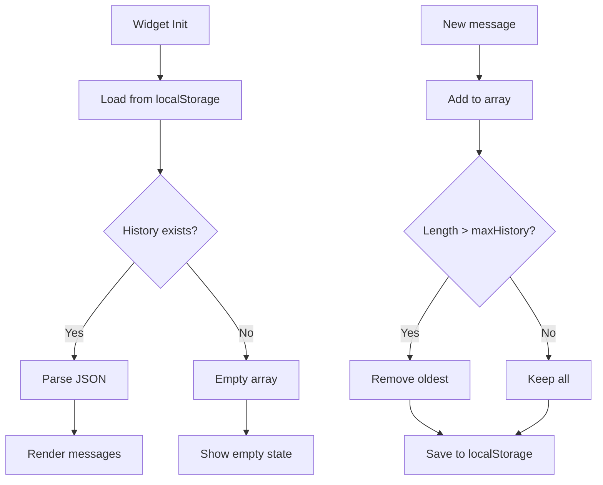
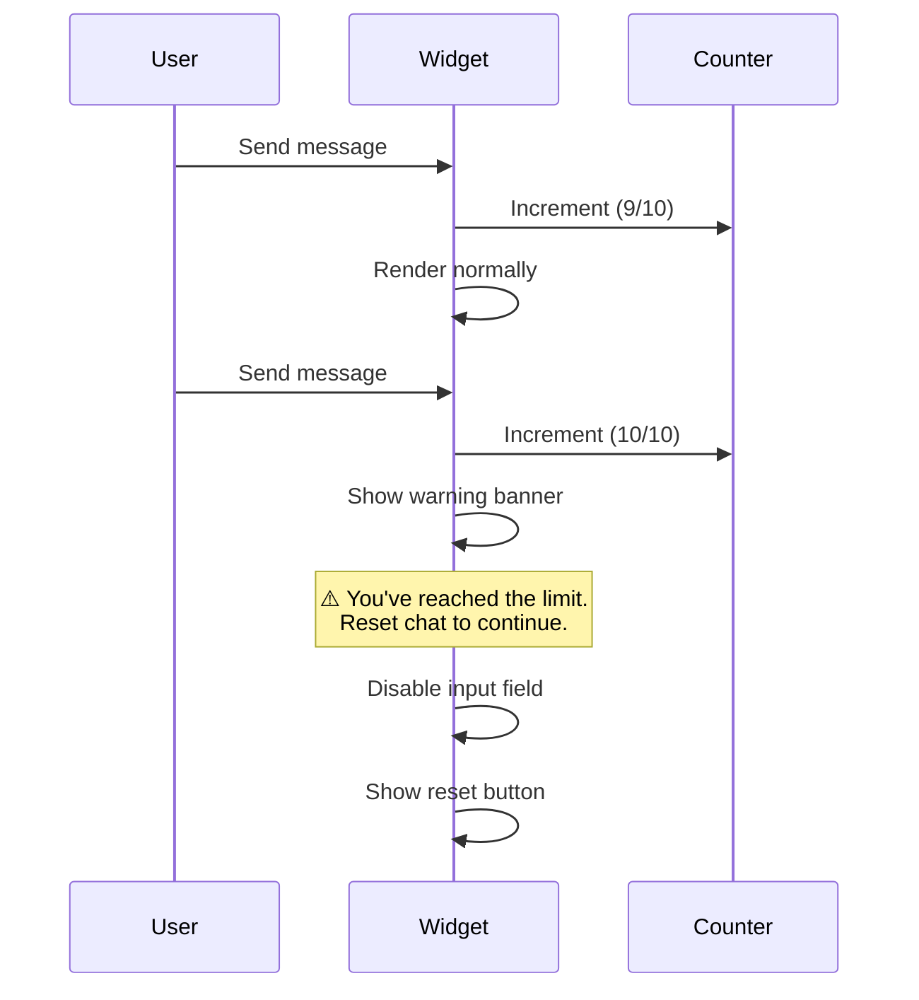
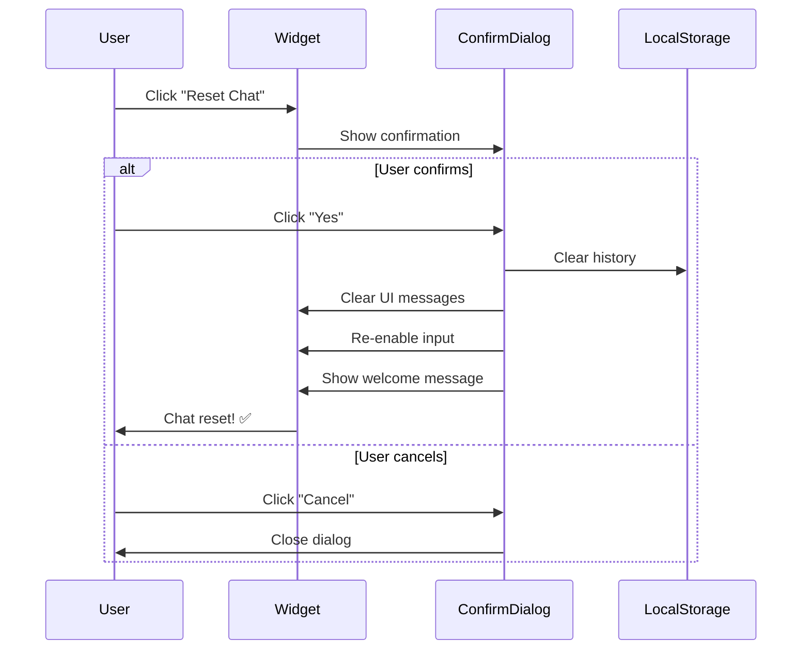
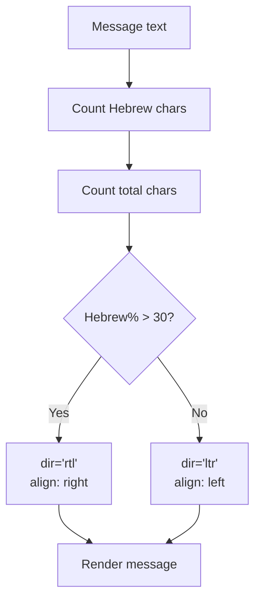
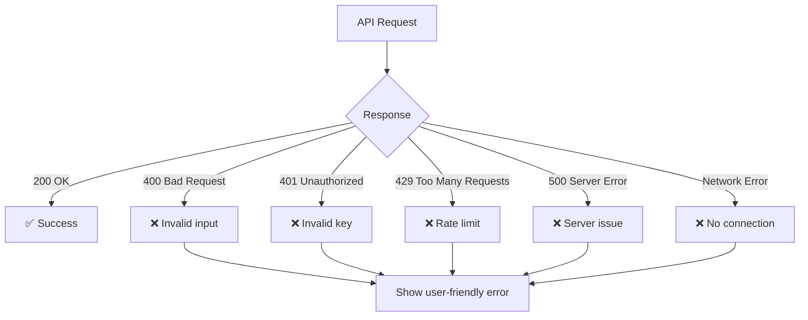
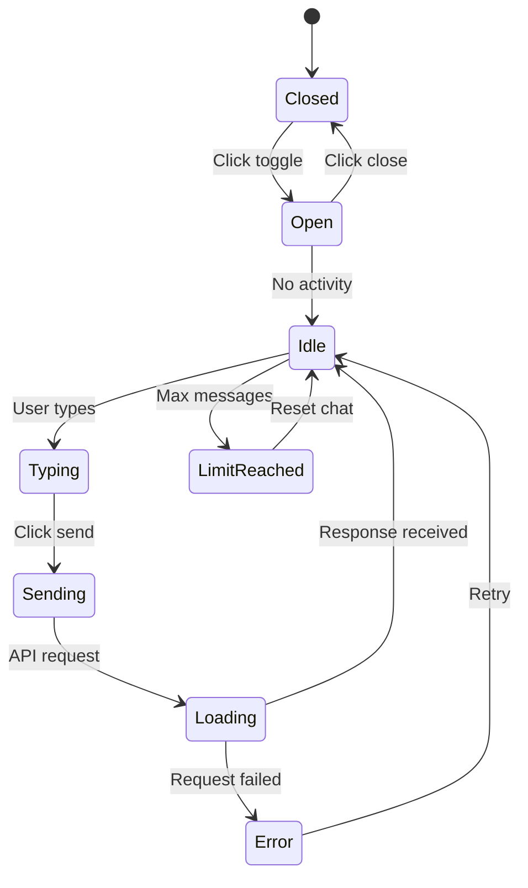
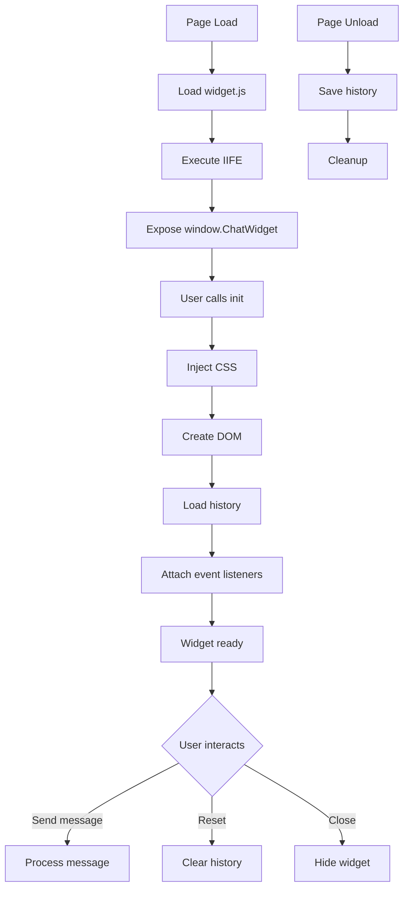

# Chat Widget Flow

> Embeddable JavaScript chat widget for websites

---

## 📑 Table of Contents

1. [Overview](#overview)
2. [Widget Initialization](#widget-initialization)
3. [Configuration Options](#configuration-options)
4. [UI Structure](#ui-structure)
5. [CSS Injection](#css-injection)
6. [Ask Question Flow](#ask-question-flow)
7. [History Management](#history-management)
8. [Limit Management](#limit-management)
9. [Reset Chat](#reset-chat)
10. [Language Detection](#language-detection)
11. [Error Handling](#error-handling)
12. [Troubleshooting](#troubleshooting)

---

## Overview

The chat widget is a standalone JavaScript file that can be embedded on any website to provide AI-powered chat functionality.

**File:** `/public/chat-widget.js`  
**Size:** ~15 KB (minified)  
**Load Time:** < 500ms  
**Dependencies:** None (vanilla JavaScript)

**Features:**
- ✅ Zero dependencies
- ✅ RTL/LTR auto-detection
- ✅ Message history (max 10)
- ✅ Customizable appearance
- ✅ Limit warnings
- ✅ Reset conversation

---

## Widget Initialization

### Loading Sequence



### Embed Code

```html
<script>
(function() {
  var script = document.createElement('script');
  script.src = 'https://custom-site-chat.com/chat-widget.js';
  script.async = true;
  script.onload = function() {
    window.ChatWidget.init({
      secretKey: 'sk_7f3e9d2c8b4a1e6f5d9c2b8a4e7f3d1c',
      apiUrl: 'https://api.custom-site-chat.com'
    });
  };
  document.body.appendChild(script);
})();
</script>
```

### IIFE (Immediately Invoked Function Expression)

```javascript
(function() {
  'use strict';
  
  window.ChatWidget = {
    init: function(config) {
      // Validation
      if (!config.secretKey) {
        console.error('ChatWidget: secretKey is required');
        return;
      }
      
      // Initialize
      this.config = config;
      this.injectStyles();
      this.createWidget();
      this.loadHistory();
    }
  };
})();
```

---

## Configuration Options

### All Options

```javascript
window.ChatWidget.init({
  // Required
  secretKey: 'sk_xxx',              // Your API secret key
  
  // Optional
  apiUrl: 'https://api.custom-site-chat.com',  // API endpoint
  title: 'Chat with us',                       // Widget title
  botName: 'Assistant',                        // Bot display name
  userAvatar: '👤',                            // User message icon
  botAvatar: '🤖',                             // Bot message icon
  maxHistory: 10                               // Max stored messages
});
```

### Option Details

| Option | Type | Required | Default | Description |
|--------|------|----------|---------|-------------|
| `secretKey` | String | ✅ Yes | - | Secret API key from settings |
| `apiUrl` | String | ❌ No | Production URL | API base URL |
| `title` | String | ❌ No | `"Chat with us"` | Widget header title |
| `botName` | String | ❌ No | `"Assistant"` | Bot's display name |
| `userAvatar` | String | ❌ No | `"👤"` | Emoji/icon for user |
| `botAvatar` | String | ❌ No | `"🤖"` | Emoji/icon for bot |
| `maxHistory` | Number | ❌ No | `10` | Max messages in history |

---

## UI Structure

### Widget Components

```
┌─────────────────────────────────────┐
│  💬 Chat with us           [×]      │ ← Header
├─────────────────────────────────────┤
│                                     │
│  🤖 Hello! How can I help?          │ ← Bot Message
│                                     │
│              Hi, I have a question 👤│ ← User Message
│                                     │
│  🤖 Sure, I'm here to help!         │ ← Bot Message
│                                     │
│  [Scroll if > 5 messages]           │ ← Messages Container
│                                     │
├─────────────────────────────────────┤
│  💬 Type your message...   [Send]   │ ← Input Area
├─────────────────────────────────────┤
│  [🔄 Reset Chat]                    │ ← Footer
└─────────────────────────────────────┘
```

### Toggle Button (Bottom-Right)

```
Closed State:
┌──────┐
│ 💬   │  ← Floating button
└──────┘

Open State:
┌──────┐
│ [Widget appears above button]
└──────┘
```

### DOM Structure

```html
<div id="chat-widget-container">
  <!-- Toggle Button -->
  <div id="chat-widget-toggle">💬</div>
  
  <!-- Widget -->
  <div id="chat-widget">
    <!-- Header -->
    <div id="chat-widget-header">
      <span>Chat with us</span>
      <button id="chat-widget-close">×</button>
    </div>
    
    <!-- Messages -->
    <div id="chat-widget-messages">
      <!-- Messages rendered here -->
    </div>
    
    <!-- Input -->
    <div id="chat-widget-input">
      <input type="text" placeholder="Type..." />
      <button id="chat-widget-send">Send</button>
    </div>
    
    <!-- Footer -->
    <div id="chat-widget-footer">
      <button id="chat-widget-reset">🔄 Reset Chat</button>
    </div>
  </div>
</div>
```

---

## CSS Injection

### Inline Styles

The widget injects CSS dynamically into `<head>`:

```javascript
function injectStyles() {
  const style = document.createElement('style');
  style.textContent = `
    #chat-widget-container { position: fixed; bottom: 20px; right: 20px; }
    #chat-widget-toggle { 
      width: 60px; height: 60px; 
      border-radius: 50%; 
      background: linear-gradient(135deg, #667eea 0%, #764ba2 100%);
      cursor: pointer;
    }
    /* ... more styles ... */
  `;
  document.head.appendChild(style);
}
```

### RTL Support

```css
/* Auto-detect direction based on message content */
.chat-message-user[dir="rtl"] {
  text-align: right;
  direction: rtl;
}

.chat-message-bot[dir="ltr"] {
  text-align: left;
  direction: ltr;
}
```

### Animations

```css
@keyframes slideUp {
  from { transform: translateY(20px); opacity: 0; }
  to { transform: translateY(0); opacity: 1; }
}

#chat-widget {
  animation: slideUp 0.3s ease-out;
}
```

---

## Ask Question Flow

### Complete Flow



### API Request

**Request:**
```http
POST /query
Content-Type: application/json

{
  "question": "What is the refund policy?",
  "secret_key": "sk_7f3e9d2c8b4a1e6f5d9c2b8a4e7f3d1c"
}
```

**Response:**
```json
{
  "answer": "According to our policy, you can request a full refund within 30 days of purchase.",
  "sources": ["doc_123", "doc_456"],
  "timestamp": "2024-12-01T10:00:00Z"
}
```

### Loading State

```
┌─────────────────────────────────────┐
│  💬 Chat with us           [×]      │
├─────────────────────────────────────┤
│                                     │
│              What is the price? 👤   │
│                                     │
│  🤖 ⏳ Typing...                     │ ← Loading
│                                     │
└─────────────────────────────────────┘
```

---

## History Management

### Storage Structure

**Key:** `chatHistory_{secretKey}`  
**Format:** JSON array of message objects

```javascript
[
  {
    "role": "user",
    "content": "What is the refund policy?",
    "timestamp": "2024-12-01T10:00:00Z"
  },
  {
    "role": "assistant",
    "content": "You can request a refund within 30 days.",
    "timestamp": "2024-12-01T10:00:15Z"
  }
]
```

### History Flow



### Max History Limit

**Default:** 10 messages (5 pairs of user + bot)  
**Reason:** Prevent localStorage quota issues  
**Behavior:** FIFO (First In, First Out)

```javascript
function addToHistory(message) {
  history.push(message);
  
  if (history.length > maxHistory) {
    history.shift(); // Remove oldest
  }
  
  localStorage.setItem(
    `chatHistory_${secretKey}`,
    JSON.stringify(history)
  );
}
```

---

## Limit Management

### Limit Warning



### UI with Warning

```
┌─────────────────────────────────────┐
│  💬 Chat with us           [×]      │
├─────────────────────────────────────┤
│  ⚠️ Limit reached (10/10)           │ ← Warning
│  Reset chat to continue asking.     │
├─────────────────────────────────────┤
│  [Previous messages...]             │
├─────────────────────────────────────┤
│  💬 [Disabled input]       [Send]   │ ← Disabled
├─────────────────────────────────────┤
│  [🔄 Reset Chat]                    │ ← Prominent
└─────────────────────────────────────┘
```

### Limit Check Logic

```javascript
function canSendMessage() {
  const messageCount = history.filter(
    msg => msg.role === 'user'
  ).length;
  
  return messageCount < maxHistory;
}
```

---

## Reset Chat

### Flow Diagram



### Confirmation Dialog

```
┌─────────────────────────────────┐
│  🔄 Reset Chat?                 │
│                                 │
│  This will delete all messages  │
│  and start a fresh conversation.│
│                                 │
│  [Cancel]  [Yes, Reset]         │
└─────────────────────────────────┘
```

### Reset Logic

```javascript
function resetChat() {
  if (!confirm('Reset chat? This will delete all messages.')) {
    return;
  }
  
  // Clear localStorage
  localStorage.removeItem(`chatHistory_${secretKey}`);
  
  // Clear UI
  messagesContainer.innerHTML = '';
  
  // Reset state
  history = [];
  
  // Show welcome message
  addBotMessage('Hello! How can I help you?');
  
  // Re-enable input
  inputField.disabled = false;
  sendButton.disabled = false;
}
```

---

## Language Detection

### Auto-Detection Logic



### Detection Code

```javascript
function detectLanguage(text) {
  const hebrewChars = text.match(/[\u0590-\u05FF]/g) || [];
  const hebrewPercentage = (hebrewChars.length / text.length) * 100;
  
  return hebrewPercentage > 30 ? 'rtl' : 'ltr';
}

function addMessage(content, role) {
  const direction = detectLanguage(content);
  const messageDiv = document.createElement('div');
  messageDiv.className = `chat-message-${role}`;
  messageDiv.setAttribute('dir', direction);
  messageDiv.textContent = content;
  messagesContainer.appendChild(messageDiv);
}
```

### Language Examples

| Text | Hebrew % | Direction |
|------|----------|-----------|
| "Hello, how are you?" | 0% | LTR |
| "שלום, מה שלומך?" | 100% | RTL |
| "Hi שלום" | 50% | RTL |
| "Hello! 123" | 0% | LTR |

---

## Error Handling

### Error Types



### Error Messages

| Error Code | User Message |
|------------|--------------|
| 400 | "Invalid question. Please try again." |
| 401 | "Authentication failed. Check your secret key." |
| 429 | "Too many requests. Please wait a moment." |
| 500 | "Something went wrong. Try again later." |
| Network | "Connection error. Check your internet." |

### Error Display

```
┌─────────────────────────────────────┐
│  💬 Chat with us           [×]      │
├─────────────────────────────────────┤
│              What is the price? 👤   │
│                                     │
│  ❌ Connection error.                │ ← Error
│     Please check your internet.     │
│                                     │
│  [Retry]                            │ ← Retry button
└─────────────────────────────────────┘
```

---

## State Management

### Widget State Object

```javascript
const widgetState = {
  // Config
  secretKey: 'sk_xxx',
  apiUrl: 'https://api.custom-site-chat.com',
  title: 'Chat with us',
  
  // UI State
  isOpen: false,
  isLoading: false,
  
  // Data
  history: [],
  maxHistory: 10,
  
  // Elements
  container: null,
  messagesDiv: null,
  inputField: null,
  sendButton: null
};
```

### State Transitions



---

## Lifecycle

### Initialization → Destruction



---

## Performance Metrics

| Metric | Value |
|--------|-------|
| **File Size** | ~15 KB (minified) |
| **Load Time** | < 500ms |
| **First Paint** | < 200ms |
| **Response Time** | 2-4 seconds (incl. GPT-4) |
| **Memory Usage** | < 5 MB |
| **LocalStorage** | < 10 KB |

---

## Troubleshooting

### Common Issues

| Issue | Cause | Solution |
|-------|-------|----------|
| Widget not appearing | Script not loaded | Check browser console for errors |
| "Invalid secret key" | Wrong key format | Copy from settings page |
| Messages not sending | Network blocked | Check CORS/firewall settings |
| History not saving | LocalStorage disabled | Enable cookies/storage |
| Widget cutoff on mobile | CSS conflict | Add `!important` to styles |
| RTL text wrong direction | Detection threshold | Adjust 30% threshold |

### Debug Mode

Add to config:

```javascript
window.ChatWidget.init({
  secretKey: 'sk_xxx',
  debug: true  // Enable console logs
});
```

---

## Summary

✅ **Standalone:** No dependencies, works anywhere  
✅ **Lightweight:** ~15 KB, loads in < 500ms  
✅ **Smart:** RTL/LTR auto-detection  
✅ **Persistent:** LocalStorage for history  
✅ **Limited:** Max 10 messages with warnings  
✅ **Customizable:** Colors, avatars, text  
✅ **Secure:** Secret key for authentication

---

[← Back to Main README](../README.md)
