# 🔐 Authentication Flow - זרימות אימות

[← חזרה ל-README הראשי](./README.md)

---

## סקירה כללית

מודול ה-Authentication כולל 5 מסלולים עיקריים:
1. **התחברות** (Login) - Email/Password + Google OAuth
2. **רישום** (Register) - Email/Password + Google OAuth  
3. **אימות מייל** (Verify)
4. **שכחתי סיסמה** (Forgot Password)
5. **איפוס סיסמה** (Reset Password)

---

## 1️⃣ זרימת התחברות (Login)

### 📊 תרשים זרימה - Email/Password Login

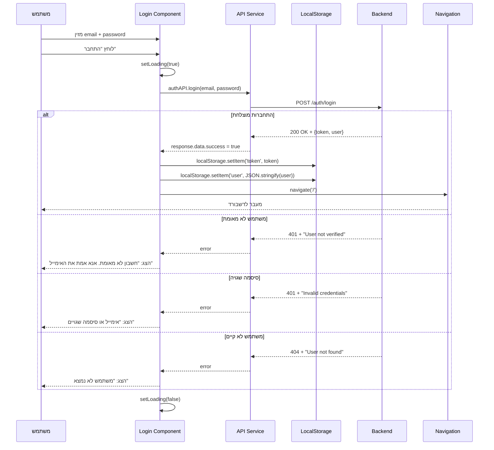

### 📊 תרשים זרימה - Google OAuth Login

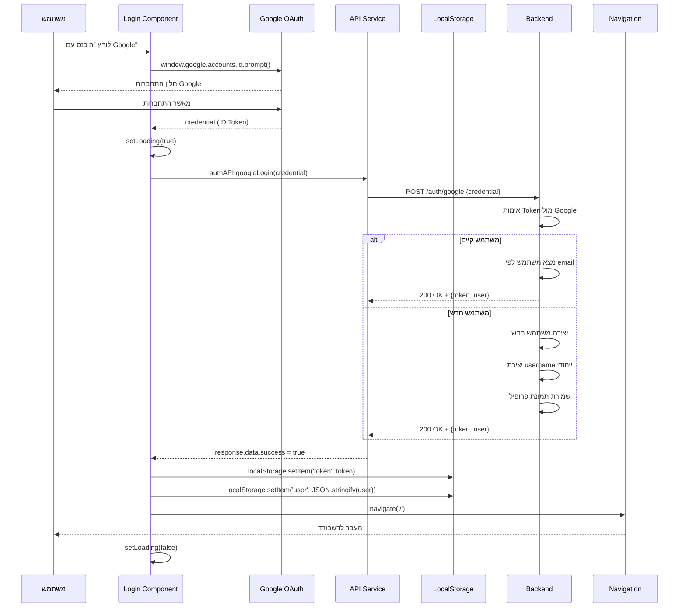

### 🎯 קבצים מעורבים

| קובץ | תפקיד |
|------|-------|
| `Login.js` | קומפוננטה ראשית |
| `Login.css` | עיצוב |
| `GoogleLoginButton.js` | כפתור Google OAuth |
| `api.js` | שירותי API |

---

## 2️⃣ זרימת רישום (Register)

### 📊 תרשים זרימה - Email/Password Registration

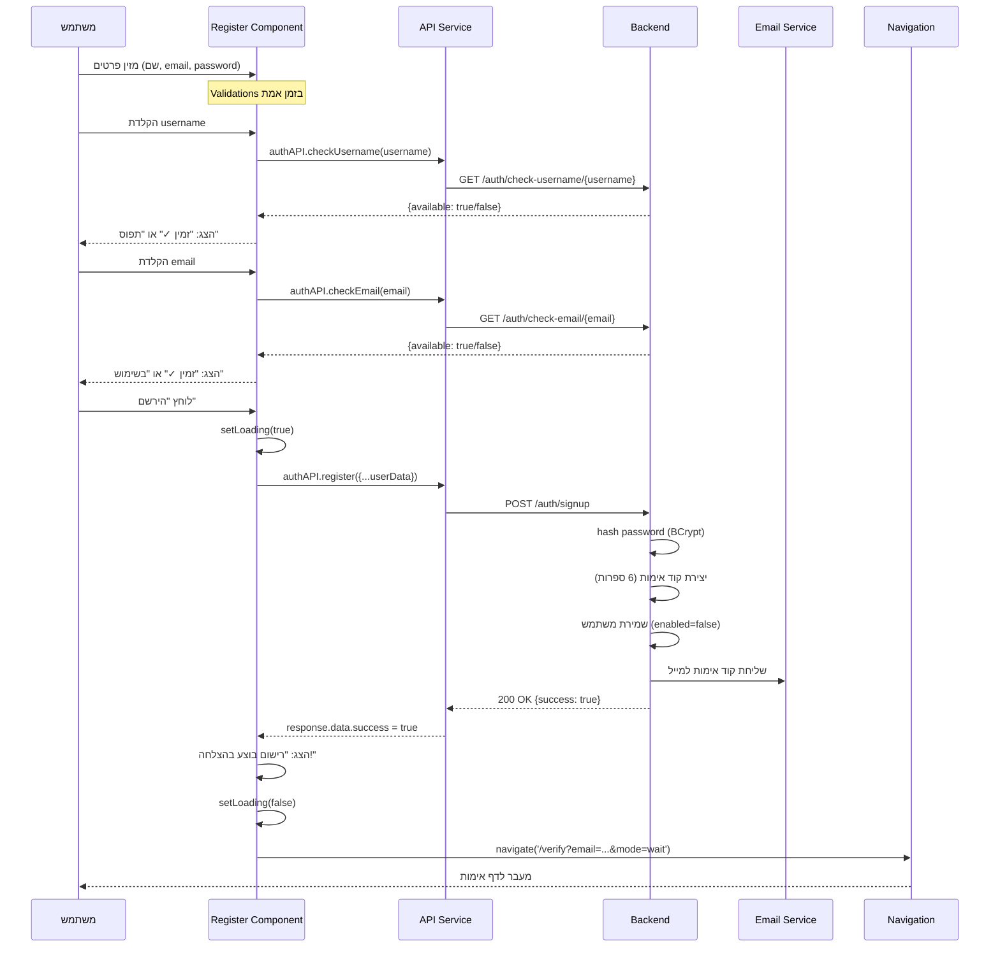

### 📊 תרשים זרימה - Google OAuth Registration

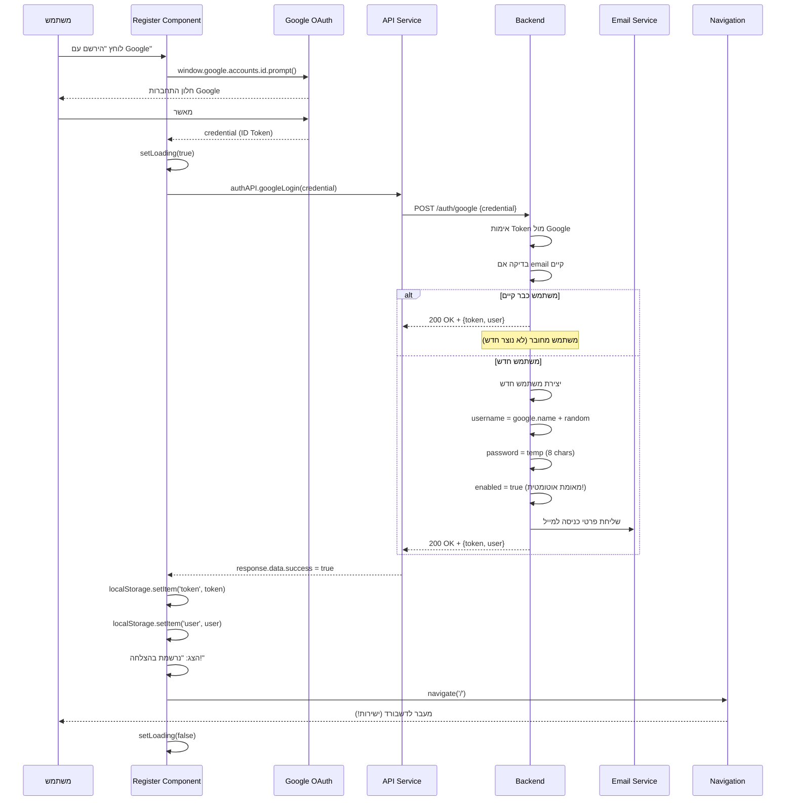

### 🎯 הבדלים מרכזיים

| תכונה | Email/Password | Google OAuth |
|-------|---------------|--------------|
| אימות מייל | נדרש (דף Verify) | לא נדרש |
| enabled | false בהתחלה | true מיד |
| password | בחירת משתמש | random (8 chars) |
| profilePictureUrl | null | מתמונת Google |

---

## 3️⃣ זרימת אימות מייל (Verify)

### 📊 תרשים זרימה - Email Verification

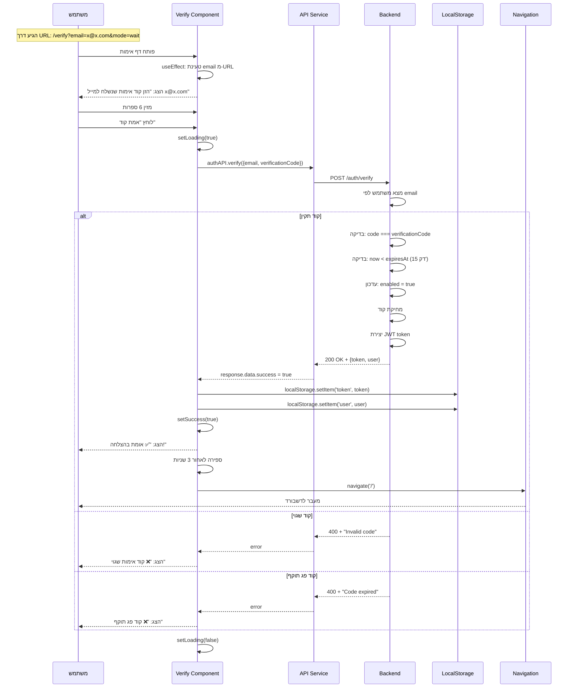

### 📊 תרשים זרימה - Resend Code

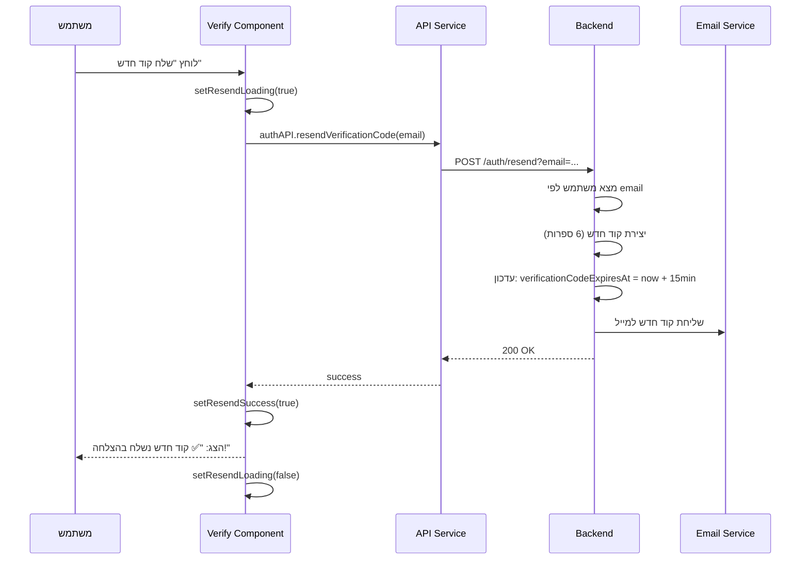

---

## 4️⃣ זרימת שכחתי סיסמה (Forgot Password)

### 📊 תרשים זרימה - Request Reset Code

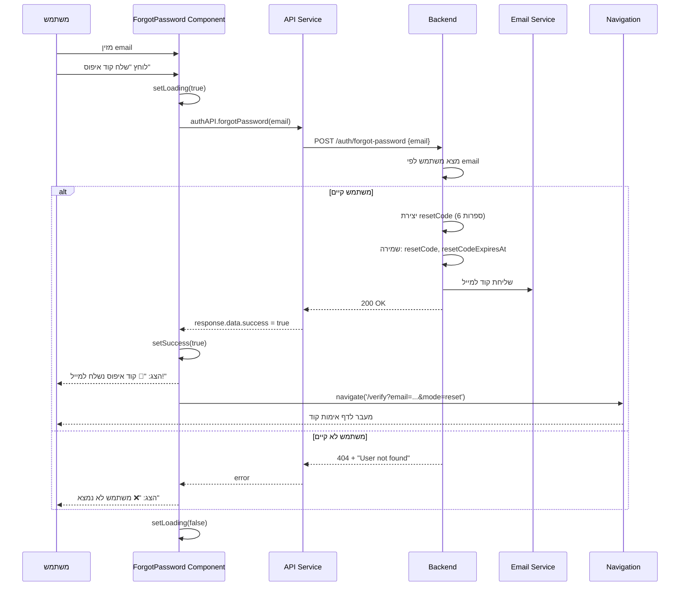

### 🎯 הבדל בין Verification לבין Reset

| תכונה | Email Verification | Password Reset |
|-------|-------------------|----------------|
| **שדה ב-DB** | `verificationCode` | `resetCode` |
| **תוקף** | 15 דקות | 15 דקות |
| **mode ב-URL** | `mode=wait` | `mode=reset` |
| **פעולה** | enabled=true | פתיחת דף איפוס |

---

## 5️⃣ זרימת איפוס סיסמה (Reset Password)

### 📊 תרשים זרימה - Reset Password (3 Steps)

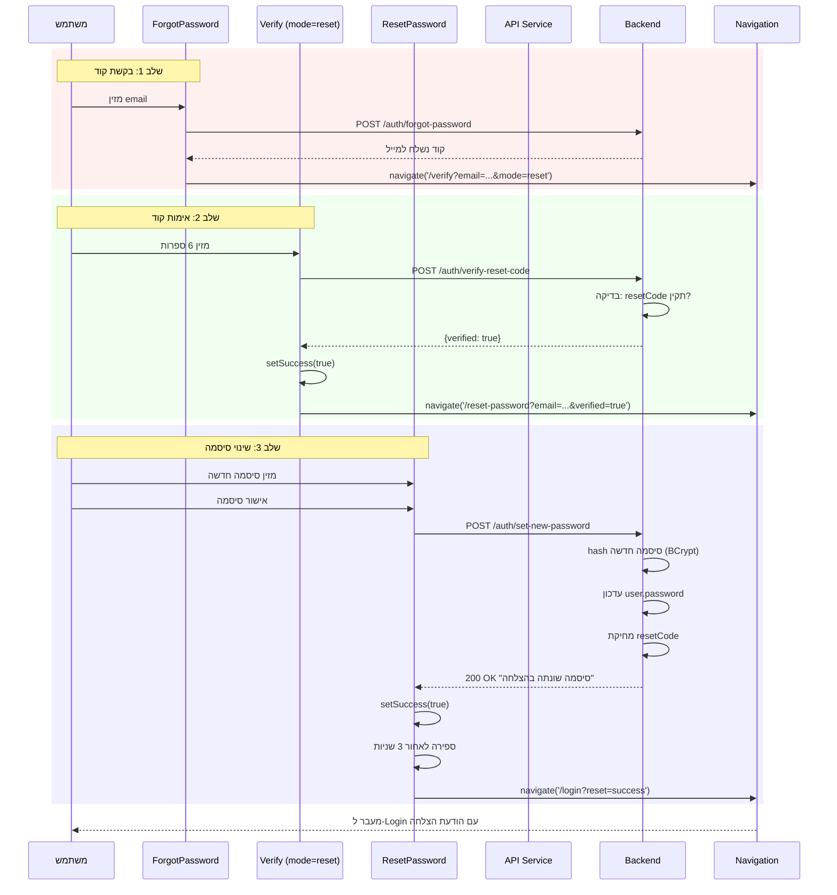

### 📊 תרשים מצבים - Password Reset States

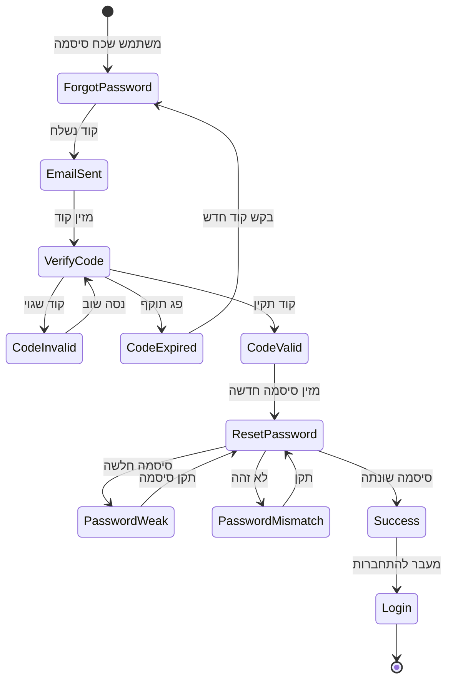

---

## 🎯 Components Relationships

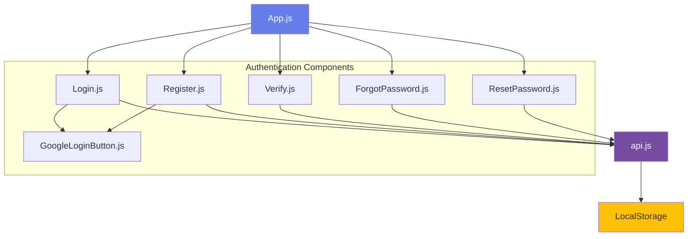

---

## 🔒 Security Features

### JWT Token Management

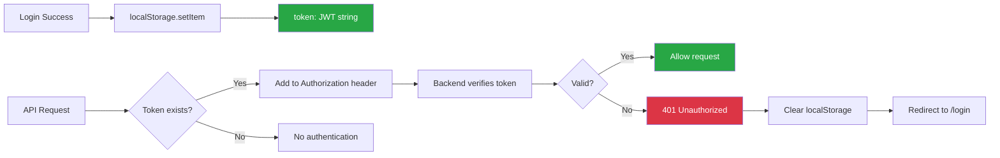

### Password Validation

| תנאי | דרישה | משוב UI |
|------|-------|---------|
| **אורך** | מינימום 6 תווים | "חלשה" / "בינונית" / "חזקה" |
| **חזקה** | 8+ תווים + אות גדולה + מספר | צבע: ירוק |
| **בינונית** | 6+ תווים + (אות גדולה או מספר) | צבע: צהוב |
| **חלשה** | 6 תווים | צבע: אדום |

---

## 📱 User Experience

### Success States

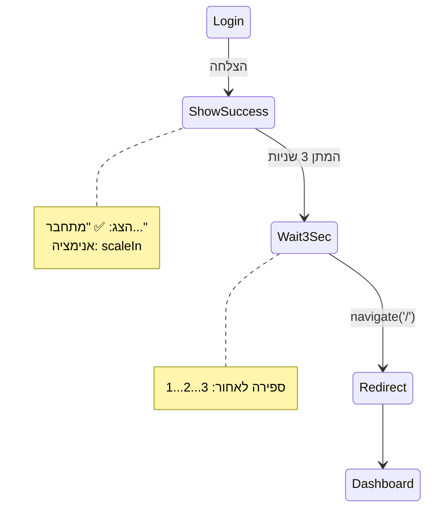

### Loading States

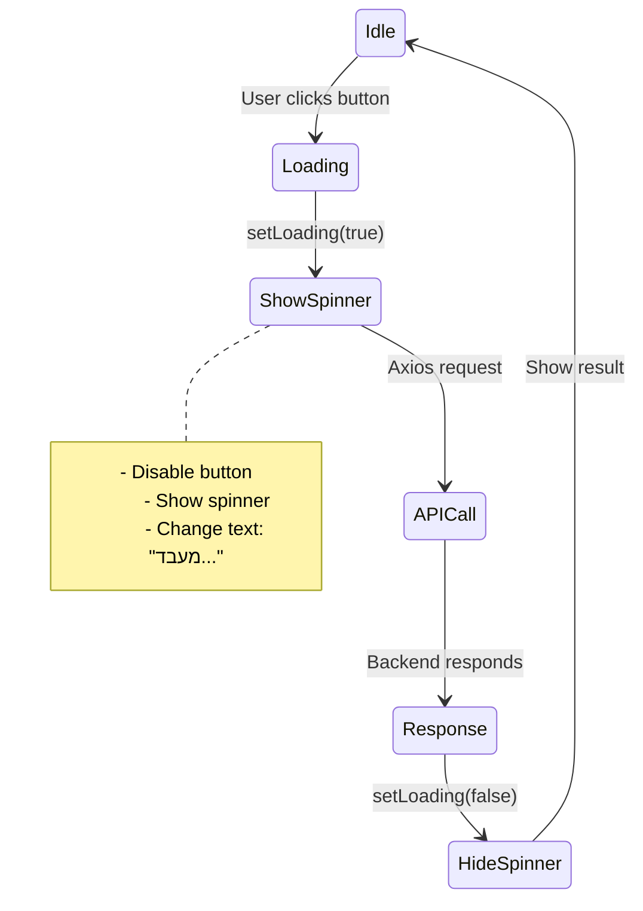

---

## 🆘 Error Handling

### Error Messages Map

| Backend Error | Frontend Message |
|--------------|------------------|
| `AUTHENTICATION_FAILED` | "אימייל או סיסמה שגויים" |
| `USER_NOT_VERIFIED` | "חשבון לא מאומת. אנא אמת את האימייל" |
| `INVALID_CODE` | "קוד אימות שגוי" |
| `CODE_EXPIRED` | "קוד פג תוקף" |
| `USER_NOT_FOUND` | "משתמש לא נמצא" |
| `DUPLICATE_EMAIL` | "האימייל כבר בשימוש" |
| `DUPLICATE_USERNAME` | "שם המשתמש כבר תפוס" |

---

[← חזרה ל-README הראשי](./README.md)
